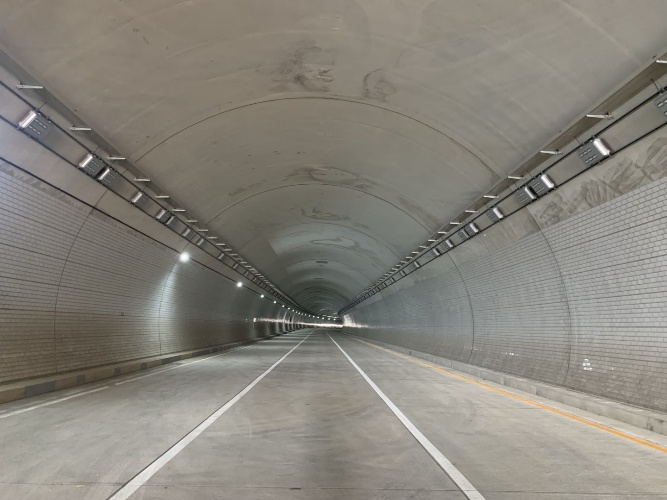
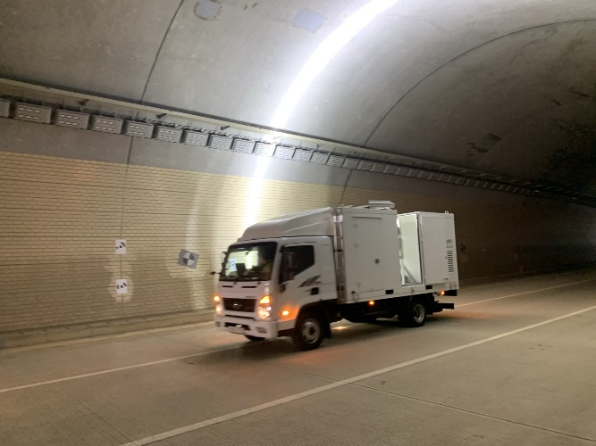
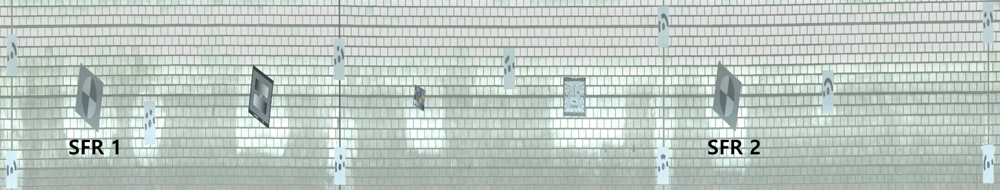
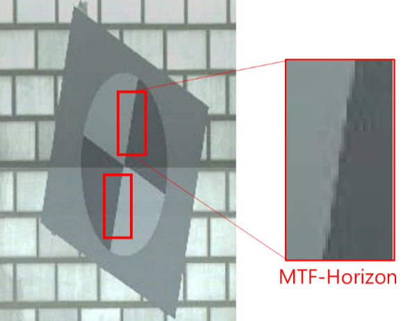

**No-Reference Image Quality Assessment for High-Speed Motion Blur Database in Tunnel Inspection**

**Chulhee Lee^1^,** **Donggyou Kim^1\*^,** **Dongku Kim^1^, and** **Junbeom** **An^1^**

^1^Department of Geotechnical Engineering Research, Korea Institute of Civil Engineering and Building Technology (KICT), Gyeonggi-Do, 10223, Republic of Korea

\*Corresponding author: Donggyou Kim (e-mail: dgkim2004@kict.re.kr).

This work was supported in part by the Korea Agency for Infrastructure Technology Advancement under Grant RS-2022-00142566.

**ABSTRACT**

Mobile Tunnel Scanning System (MTSS) enhances the efficiency of structural health monitoring. However, motion blur (MB) caused by high-speed movement remains a major technical challenge that reduces the reliability of automated defect detection algorithms. We propose a framework to quantitatively evaluate high-speed motion blur and manage image quality in real time. A custom-built High-Speed Translational Motion Panel (HTMP) was developed to simulate MTSS operating conditions at speeds up to 110 km/h and to construct a High-Speed Motion Blur (HSMB) benchmark dataset. Based on this dataset, we introduce a no-reference image quality assessment (NR-IQA) metric, the HSMB metric, which is computationally efficient and interpretable. Performance was validated through correlation analysis with blurred edge width (BEW) and modulation transfer function at 50% contrast (MTF50). The HSMB metric achieved the highest linear correlation with BEW in laboratory settings (Pearson linear correlation coefficient \[PLCC\] = 0.9354) and strong rank-order correlation in real-world tunnel tests (Spearman rank-order correlation coefficient \[SROCC\] = 0.8000), comparable to state-of-the-art metrics. These results confirm the robustness and applicability of the method under complex conditions. The HSMB metric enables real-time filtering of low-quality motion-blurred images, improving the reliability of automated structural health evaluations.

**KEYWORDS:** High-Speed Motion Blur (HSMB) Metric, Mobile Tunnel Scanning System (MTSS), No-Reference Image Quality Assessment (NR-IQA), Motion Blur (MB), Modulation Transfer Function (MTF)

I.  **INTRODUCTION**

Structural health monitoring (SHM) technologies are increasingly important for ensuring the safety and longevity of critical infrastructure such as tunnels and bridges. Advances in computer vision and deep learning have improved automation and efficiency in inspection processes, addressing limitations of traditional contact-based methods \[1-8\]. The Mobile Tunnel Scanning System (MTSS), which uses high-resolution cameras mounted on moving vehicles to detect defects such as cracks on tunnel lining surfaces, has emerged as a promising solution \[9,10\]. However, MTSS performance is significantly constrained by motion blur (MB), an unavoidable artifact caused by high-speed travel. The resulting image degradation reduces the reliability of convolutional neural network (CNN)-based defect detection algorithms, posing a major challenge to automated inspection systems \[11-16\].

Various post-processing techniques, including image deblurring, have been explored to address MB \[17,18\]. However, effective development and evaluation of these methods require benchmark datasets that reflect real-world distortions. Public datasets such as Need for Speed \[19\], DeBlurNet \[20\], GOPRO \[21\], Realistic and Diverse Scenes \[22\], Human-aware Image Deblurring \[23\], and the Real-World Blur Dataset \[24\] typically generate blur through artificial frame averaging from high-speed videos \[25\]. This synthetic approach differs from real-world imaging, where light is continuously recorded during sensor exposure. Consequently, these datasets do not capture the distinct MB characteristics of MTSS environments, in which exposure settings and high-speed translational motion interact. Moreover, the lack of reliable real-time image quality criteria limits the ability to filter degraded data or assess deblurring performance in practice. In such scenarios, where reference images are unavailable, no-reference image quality assessment (NR-IQA) is essential \[26,27\].

This study proposes an integrated framework to physically model and quantitatively evaluate MB in high-speed environments. We developed a High-Speed Translational Motion Panel (HTMP) to simulate MTSS operating conditions in a controlled laboratory setting at speeds up to 110 km/h and constructed a high-speed motion blur dataset under varying speeds, shutter speeds, and lighting conditions. Instead of relying on subjective measures such as mean opinion score (MOS), we adopted BEW, derived from modulation transfer function (MTF), as an objective physical ground-truth indicator of MB.

To enable real-time deployment in systems such as MTSS, we developed and validated a computationally efficient NR-IQA metric, the HSMB metric, designed specifically for high-speed MB images. We evaluated its generalization performance using public datasets and further verified its applicability with field images acquired from an operational MTSS system.

The remainder of this paper is organized as follows. Section 2 reviews related work. Section 3 describes the HTMP design and HSMB dataset construction. Section 4 presents the HSMB metric algorithm. Section 5 reports experimental results. Section 6 provides field validation using MTSS. Sections 7 and 8 present discussion and conclusions.

II. **RELATED RESEARCH**

<!-- -->

A.  ***FULL-REFERENCE IMAGE QUALITY ASSESSMENT (FR-IQA)***

In IQA, mean squared error (MSE) was historically widely used to evaluate image restoration performance. However, it has been criticized as an objective metric because it does not adequately reflect human perceptual quality, as different images can share the same MSE value yet be perceived differently \[28\]. To overcome this limitation, peak signal-to-noise ratio (PSNR) and structural similarity index metric (SSIM) \[29\] were introduced and have become two of the most widely adopted metrics in image deblurring research.

PSNR measures similarity between original and restored images by calculating the ratio of maximum signal power to noise power based on MSE. It is primarily used to assess degradation caused by noise \[30\] and is more sensitive to noise reduction and Gaussian blur than SSIM \[31\]. In contrast, SSIM evaluates image similarity by comparing luminance, contrast, and structural components. It is particularly responsive to variations in brightness and contrast and has been shown to be more sensitive than PSNR to degradation caused by JPEG and JPEG2000 compression artifacts \[32\]. Because PSNR and SSIM respond to different distortion types, they are often used together.

Several FR-IQA methods have been developed based on SSIM, including multi-scale SSIM (MS-SSIM) \[33\] and complex wavelet-based SSIM (CW-SSIM) \[34\]. MS-SSIM is widely applied in display technology but is not specifically optimized for MB assessment. CW-SSIM improves structural similarity evaluation in blurred images by reducing sensitivity to small pixel shifts and rotations; however, it is not directly designed to quantify MB. To address this limitation, Abdullah-Al-Mamun et al. \[35\] proposed the blur level (BL) metric, which captures blur induced by pixel shifts and rotations, factors not fully addressed by CW-SSIM. Although BL demonstrates improved performance over SSIM and PSNR in representing MB and sharpness, especially in low-light or low-texture images, it does not provide directional information about blur.

A fundamental limitation of FR-IQA methods is their reliance on undistorted reference images. In tunnel inspection scenarios involving MTSS, high-speed movement prevents acquisition of clear reference images, limiting the feasibility of physically grounded blur evaluation.

B.  ***REDUCED-REFERENCE IMAGE QUALITY ASSESSMENT (RR-IQA)***

The MTF is widely used to assess image sharpness in vision-based camera systems \[36\]. It quantifies the frequency-domain response of imaging systems, including microscopy, radiography, and remote sensing applications \[37-40\], and is defined as the Fourier transform of the point spread function (PSF), which characterizes blur. Therefore, spatial resolution can be evaluated through the high-frequency behavior of the MTF \[41\].

Several studies have experimentally examined MB by analyzing variations in MTF. Dinh et al. \[36\] developed an indoor rotational testing device to investigate MB induced by rotational motion and demonstrated that longer exposure times lead to flatter PSF slopes and reduced MTF values. Luo et al. \[42\] reported similar findings by recording video with a mobile phone moving linearly at 1 m/s, observing PSF broadening and MTF reduction as speed increased.

However, MTF measurement requires specialized test charts and does not readily capture directional MB, which limits its applicability in deep learning environments that rely on natural images or publicly available datasets \[35\]. This limitation becomes more pronounced in high-speed translational motion environments such as MTSS, where conventional MTF-based methods struggle to represent real MB characteristics. To address this challenge, a tunnel-simulated indoor experimental environment is required to enable controlled acquisition of MB image data by adjusting parameters such as camera motion, exposure settings, and illumination, thereby allowing accurate capture of PSF-related information.

C.  ***NO-REFERENCE IMAGE QUALITY ASSESSMENT (NR-IQA)***

NR-IQA methods estimate the degree of image degradation by analyzing distorted images without requiring a reference image, making them practical and efficient for real-world applications \[26,42\]. These approaches are generally categorized into spatial-domain and spectral-domain methods. Spatial-domain techniques use gradient and edge information for rapid evaluation but are often sensitive to noise \[27\]. In contrast, spectral-domain methods analyze frequency characteristics to assess distortions such as MB, although they are typically computationally intensive \[43\].

Recently, deep learning-based approaches have become prominent in NR-IQA research. Architectures such as Swin Transformers demonstrate high accuracy by capturing global image features effectively \[44,45,46\]. In addition, meta-learning and few-shot learning strategies have improved performance by reducing reliance on large-scale labeled datasets \[47,48\].

Despite the strong performance of deep learning-based NR-IQA methods, this study adopts a knowledge-based approach to prioritize applicability in MTSS field environments. State-of-the-art models such as the Swin Transformer require substantial computational resources, making real-time processing challenging in MTSS systems that generate large volumes of high-speed images. Furthermore, deep learning models depend on large labeled datasets tailored to specific MB characteristics, which are currently unavailable for MTSS. These models also operate as \"black boxes,\" limiting interpretability of quality score derivation. In contrast, knowledge-based methods provide clearer interpretability by directly linking measurable outcomes to physical phenomena such as edge blurring. This transparency strengthens both reliability and explanatory value. Accordingly, this study develops a lightweight algorithm that operates efficiently under constrained computational resources while accurately characterizing specific distortion types.

To evaluate NR-IQA algorithm performance, several standard image databases are commonly used, including the Laboratory for Image and Video Engineering (LIVE) \[49\], Categorical Subjective Image Quality (CSIQ) \[50\], Tampere Image Database 2008 (TID2008) \[51\], Tampere Image Database 2013 (TID2013) \[52\], the Blurred Image Dataset (BID) \[53\], and the University of Helsinki CID2013 \[54\]. These databases provide subjective quality scores obtained under standardized conditions. Image quality is expressed using MOS or differential mean opinion score (DMOS). Performance is typically assessed by analyzing correlations with MOS using metrics such as Pearson linear correlation coefficient (PLCC), Spearman rank-order correlation coefficient (SROCC), Kendall rank-order correlation coefficient (KRCC), and root MSE (RMSE) \[55\].

However, the NR-IQA proposed in this study is specifically designed to evaluate motion-blurred images in MTSS environments, which makes validation using conventional MOS-based methods challenging. Existing public datasets lack physical information, such as PSF, and do not adequately represent the non-uniform MB and camera exposure conditions characteristic of MTSS environments. To address this limitation, we propose a validation framework based on the HSMB dataset, constructed to simulate MTSS conditions, and evaluate correlations with objective MTF-based ground-truth values. This approach improves the reliability of MB assessment in real-world applications.

III. **HSMB DATASET**

<!-- -->

A.  ***HTMP DEVICE***

To date, no study has experimentally examined MB in imaging environments exceeding 70 km/h (≈19.4 m/s). To simulate high-speed MTSS operating conditions and establish a database for analyzing blur characteristics, we employed a HTMP device introduced in prior research \[56\].

{width="3.8125in" height="3.204861111111111in"}The HTMP device is shown in Fig. 1. The system is driven by a high-precision servo motor controlled through a programmable logic controller (PLC), and the panel moves along a rotational trajectory. This configuration enables velocity control in 10 km/h increments up to a maximum speed of 110 km/h. An Imatest® ISO 12233:2017 edge spatial frequency response (eSFR) test chart for MTF measurement can be mounted on the panel surface, as shown in Fig. 2.

{width="3.125in" height="2.0840496500437444in"}

B.  ***EXPERIMENTAL SETUP AND MEASUREMENT STANDARDS***

To ensure objectivity and reproducibility, an indoor testing environment was constructed in accordance with the ISO 12233 standard, as illustrated in Fig. 3. Image acquisition was conducted using a Phantom VEO4K Basler camera from KOMI equipped with a CMOS sensor with a resolution of 4,096 × 2,304 pixels and a 25 mm prime lens. The distance between the camera and the HTMP panel was fixed at 1.5 meters. The aperture was set to F2.8 to maintain adequate depth of field. Illumination was provided by two 120 W daylight-balanced LED floodlights with a color temperature of 5,600 K positioned at 45° relative to the test chart, ensuring consistent illuminance levels of 15,000 lx and 40,000 lx.

For measurement of physical image quality characteristics, we used the Imatest® eSFR ISO test chart, which complies with the ISO 12233 standard for spatial frequency response (SFR) measurement of low-contrast edges. In addition to sharpness evaluation, the chart includes elements for assessing lateral chromatic aberration, white balance, tone response, color accuracy, and noise \[57\].

  ------------------------------------------------------------------------------------------------------------------------------------------------------------------
  {width="2.4in" height="1.825in"} (a)   {width="2.3305555555555557in" height="1.7472222222222222in"}(b)
  ------------------------------------------------------------------- ----------------------------------------------------------------------------------------------

  ------------------------------------------------------------------------------------------------------------------------------------------------------------------

C.  ***CONSTRUCTION OF HSMB DATASET***

Using the custom-built HTMP device and the standardized experimental setup, we constructed the HSMB dataset. As shown in Table 1, data acquisition was performed by controlling three key variables: translational speed, camera shutter speed, and illumination level. The HTMP was operated at 0 km/h (static), 10 km/h, 30 km/h, 50 km/h, and 70 km/h. For each speed condition, shutter speeds were set to 50 μs, 100 μs, 250 μs, and 500 μs, and ISO sensitivity was adjusted to 640, 1,250, and 1,600 accordingly.

Table 1: Test conditions for capturing MB using moving panel and area scan camera

+-------------+---------------+----------+----------+----------+-------------+
| Panel speed | Shutter speed | ISO      | F-number | FPS      | Illuminance |
+=============+===============+==========+==========+==========+=============+
| 0 km/h      | 500 ㎲        | 640      | 2.8      | 100      | 15,000 lx   |
|             |               |          |          |          |             |
| 10 km/h     |               |          |          |          | 40,000 lx   |
|             |               |          |          |          |             |
| 30 km/h     |               |          |          |          |             |
|             |               |          |          |          |             |
| 50 km/h     |               |          |          |          |             |
|             |               |          |          |          |             |
| 70 km/h     |               |          |          |          |             |
|             +---------------+----------+          |          |             |
|             | 250 ㎲        | 1250     |          |          |             |
|             +---------------+----------+          |          |             |
|             | 100 ㎲        | 1600     |          |          |             |
|             +---------------+----------+          |          |             |
|             | 50 ㎲         | 1600     |          |          |             |
+-------------+---------------+----------+----------+----------+-------------+

Video footage captured by the HTMP included frames containing both the black background and the test chart. From each video, 30 images were extracted per test condition by selecting frames in which the entire test chart was visible, as illustrated in Fig 4.

{width="6.365277777777778in" height="1.1041666666666667in"}

The finalized HSMB dataset consists of 320 images generated from five speed conditions, four shutter speed settings, and two lighting conditions, with 10 images obtained for each condition. This dataset enables quantitative analysis of MB characteristics under high-speed translational movement and supports development and validation of the HSMB metric algorithm (Fig.5, Fig.6).

{width="6.504166666666666in" height="4.1402777777777775in"}

{width="6.495138888888889in" height="4.017361111111111in"}

D.  ***MODULATION TRANSFER FUNCTION (MTF)***

The slanted-edge method defined in ISO 12233 measures SFR by analyzing an angled edge on a standardized test chart \[58\]. Figure 7 illustrates this procedure. In the eSFR ISO test chart, slanted edges are positioned between 5° and 7°, and the region of interest (ROI) is defined as a rectangular area crossing the short side of the edge, as shown in Fig. 7(a). Figure 7(b) presents the one-dimensional edge spread function (ESF), in which BEW represents the pixel width measured between the 10% and 90% rise distances of the ESF.

  --------------------------------------------------------------------------------------------------------------------------------------------------------------------------------------------------------------------------------------------------------------------------------
  {width="2.1347222222222224in" height="1.0256944444444445in"}(a)   {width="1.9125in" height="1.0430555555555556in"}(b)   {width="1.8659722222222221in" height="1.0430555555555556in"}(c)
  ---------------------------------------------------------------------------------------------- ---------------------------------------------------------------------------------- ----------------------------------------------------------------------------------------------

  --------------------------------------------------------------------------------------------------------------------------------------------------------------------------------------------------------------------------------------------------------------------------------

Figure 7: Illustration of slanted edge-based modulation transfer function (MTF) estimation process: (a) selection of a region of interest (ROI), (b) normalized edge spread function (ESF), and (c) estimated MTF

This approximation is obtained using a finite-difference filter and a Hamming window, followed by a discrete Fourier transform (DFT). The resulting normalized complex coefficients are used to estimate MTF, as shown in Fig. 7(c). MTF corresponds to the Fourier transform of the impulse response, which is the derivative of the edge response. In sampled imaging systems, MTF provides a reliable measure of image resolution and sharpness by indicating the level of detail that the camera can reproduce \[59\].

MTF50 denotes the spatial frequency at which contrast decreases to 50% of its low-frequency value, whereas MTF50P represents the frequency at which contrast decreases to 50% of its peak value \[60\]. Lower MTF values indicate reduced image quality. Koren \[61\] demonstrated that MTF50 values obtained using the Imatest® program strongly correlate with human-perceived sharpness.

  ------------------------ ---------------------- ---------------------

  ------------------------ ---------------------- ---------------------

Figure 8 presents the ROI defined in Fig. 7(a), corresponding to the slanted edge located at the center of the test chart. Figure 8(a) illustrates the ROI captured at the slowest shutter speed of 500 μs, whereas Fig. 8(d) shows the ROI obtained at the fastest shutter speed of 50 μs. Visual inspection indicates that MB increases with increasing HTMP speed and decreases as shutter speed becomes faster. However, although ISO sensitivity was increased to compensate for reduced exposure time, images captured at faster shutter speeds tend to appear darker.

{width="5.4in" height="2.46875in"}

{width="5.35625in" height="2.207638888888889in"}(a)

\(b\)

{width="5.395833333333333in" height="2.2083333333333335in"}{width="5.41875in" height="2.234722222222222in"}(c)

\(d\)

Figure 8: Comparison of MB and contrast of slanted-edge images between 15,000 lx and 40,000 lx: (a) shutter speed 500 ㎲, (b) shutter speed 250 ㎲, (c) shutter speed 100 ㎲, and (d) shutter speed 50 ㎲.

IV. **PROPOSED NO-REFERENCE IMAGE QUALITY ASSESSMENT**

<!-- -->

A.  ***MOTIVATION FOR HSMB METRIC AND LIMITATIONS OF EXISTING NR-IQA***

Accurate evaluation of MB in high-speed imaging is essential for maintaining image quality and improving defect detection reliability in applications such as tunnel inspection. However, most existing no-reference image quality assessment (NR-IQA) metrics were developed for general image quality evaluation and are not optimized for MB characteristics specific to high-speed environments.

For example, Blind/Referenceless Image Spatial Quality Evaluator (BRISQUE) \[45\] and Naturalness Image Quality Evaluator (NIQE) \[62\] are based on Natural Scene Statistics (NSS) models. Although these metrics perform well for common distortions such as JPEG compression artifacts, noise, and generic blur, they are less effective in capturing the statistical properties of MB in MTSS environments, where blur is directionally biased and varies in intensity. Because these models are trained on datasets containing predefined distortion types, their adaptability to environments with distinct blur characteristics is limited.

Perceptual Image Quality Evaluator (PIQE) \[64\] assesses image quality using block-based feature extraction and machine learning classification. However, MB in high-speed settings is often spatially non-uniform and directionally dependent. Block-based methods have difficulty representing fine-grained spatial variations and directional blur patterns, reducing their effectiveness in estimating overall blur severity.

Cumulative Probability of Blur Detection (CPBD) \[64\] evaluates blur by analyzing luminance variations at edges detected through the Canny filter. This approach is suitable for detecting structural defects such as cracks in infrastructure images. CPBD incorporates the concept of Just Noticeable Blur (JNB), which identifies the minimum BL perceptible near edges under contrast conditions exceeding Just Noticeable Difference (JND). It primarily assesses globally uniform blur using cumulative probability \[65\]. However, its performance may decline when images contain localized or complex blur patterns \[66\].

Overall, general-purpose NR-IQA metrics, including BRISQUE, NIQE, and PIQE, do not fully represent HSMB characteristics. Although CPBD is applicable in certain structural inspection contexts, its reliance on edge detection may reduce accuracy under specific conditions. Because MB in high-speed environments such as MTSS differs substantially from common distortions, development of a dedicated NR-IQA metric tailored to these conditions is necessary.

To address these limitations, this study proposes the HSMB metric, a novel NR-IQA method designed to improve the reliability of image quality assessment in MTSS environments by capturing the distinctive characteristics of high-speed motion blur. The metric incorporates an approach that increases sensitivity to edge variations and enables more robust estimation of blur severity. Ultimately, it aims to reduce defect detection errors caused by MB.

B.  ***OVERVIEW OF HSMB METRIC***

The HSMB metric is based on the active edge pixel (AEP) approach. Unlike conventional methods such as CPBD, which rely on traditional edge detectors, including the Canny filter and may yield unreliable blur estimation when edge information is incomplete or incorrectly identified, HSMB avoids such detectors. Instead, it directly analyzes image gradient magnitudes to quantify blur. This design reduces the influence of cracks and noise in tunnel images and supports more stable measurement of blur severity. HSMB identifies blur by detecting abrupt intensity variations in edge regions and quantifies blur spread within these regions to generate a final score. The algorithmic block diagram of the HSMB metric is shown in Fig. 9.

{width="4.825694444444444in" height="3.1333333333333333in"}Figure 9: Block diagram of HSMB metric

The overall HSMB process proceeds as follows:

1.  To account for local image characteristics, the input image is divided into 64 × 64 blocks. This partitioning enables detection of fine edge details across the image. Block-based analysis, including computation of local averages, is commonly applied in NR-IQA methods such as BRISQUE and allows the metric to respond to localized image variations.

2.  {width="4.3909722222222225in" height="2.147222222222222in"}For each pixel within a block, vertical (x-direction) and horizontal (y-direction) gradients are calculated using the Sobel operator. The gradient vector magnitude is computed to represent edge strength. The mean edge strength of all pixels in the block is multiplied by a weighting factor (Edge Weight) to determine the threshold value T, as defined in equation (1). Pixels with edge strength greater than T are selected as AEPs for blur assessment. Based on tunnel image experiments, Edge Weight was empirically set to 1.5 so that approximately the top 75% of gradient magnitudes are classified as AEPs (see Fig. 10).

Figure 10: AEP selection example

$T\  = \frac{\sum_{}^{}{Gradient\ magnitude\ of\ pixel\ in\ the\ block}}{Number\ of\ pixels\ in\ th\ block}\  \times Edge\_ Weight$ (1)

3.  The edge direction of each AEP is determined by identifying the direction of maximum intensity variation among its neighboring pixels. Although CPBD computes edge direction as a continuous value in radians, the proposed method simplifies computation by restricting direction to four principal orientations (0°, 90°, 180°, 270°), with optional inclusion of diagonal orientations (45°, 135°, 225°, 315°) as additional parameters.

4.  {width="2.7416666666666667in" height="1.4083333333333334in"}{width="2.6430555555555557in" height="1.4722222222222223in"}An edge profile is constructed along the direction of each AEP, consisting of up to 10 neighboring pixels aligned with the selected orientation. Unlike conventional ESF-based methods, which define edge width as the pixel interval between 20% and 80% of intensity variation (see Fig. 11(a)), the proposed method interpolates the precise location at which pixel intensity variation exceeds a defined threshold, referred to as the Edge Variation Parameter (EVP), with sub-pixel precision (see Fig. 11(b)). The EVP is computed as a weighted average of edge magnitudes within the block and normalized within the 10--90% range based on pixel intensity profiles. This formulation increases robustness to noise compared with ESF-based methods, where low-intensity edge variations may be incorrectly interpreted as blur. By applying a consistent EVP across all pixels within a block, HSMB filters out edges with insufficient magnitude and reduces noise influence.

> \(a\) (b)
>
> Figure 11: Method of edge-width estimation: (a) Edge width estimation from ESF and (b) Edge width estimation in HSMB

  -------------------- -------------------

  -------------------- -------------------

5.  Next, the probability of blur ($P_{blur}(e_{i}$) for a given AEP ($e_{i}$) is calculated using equation (2). Based on empirical analysis, the JNB value was set to 3, and the parameter $\beta$ was fixed at 2 for all experiments.

\(2\)

The blur probability $P_{blur}(e_{i}$ ranges between 0 and 1. The final HSMB score is computed using equation (3), where the threshold 𝑃*~jnb~* is set to 0.63.

\(3\)

Here,

$$P\left( P_{blur} \right)$$

represents the value of the probability distribution function (PDF) for a given

$$P_{blur}$$

. In practice, the HSMB value is obtained by constructing the cumulative distribution function (CDF) from the PDF and extracting the corresponding value at P~jnb~ = 0.63.

C.  ***SENSITIVITY ANALYSIS***

The HSMB metric depends on three key parameters summarized in Table 2, and its final output is determined by their combined influence. To evaluate the contribution of each parameter to the HSMB output, a sensitivity analysis was performed using Sobel sensitivity indices \[67\].

Table 2: Parameters used for sensitivity analysis

  ---------------------------------------------------------------------------------------------------------------------------------------------------------------------------------------------------------------------------------------------------------------------------------------------------------------------------------------------------------------------------------------------------------------
  Parameter         Range                          Explanation
  ----------------- ------------------------------ --------------------------------------------------------------------------------------------------------------------------------------------------------------------------------------------------------------------------------------------------------------------------------------------------------------------------------------------------------------
  Edge Weight       1.0, 1.1, 1.2, 1.3, 1.4, 1.5   Applied to the average edge magnitude of all pixels in a block; used to determine which pixels qualify as AEPs.

  Threshold Ratio   0.3, 0.4, 0.5, 0.6             After identifying AEPs, the edge profile is constructed by selecting the direction with the highest pixel intensity change among 4 or 8 neighboring directions. This parameter serves as a weighting factor when tracking changes in pixel intensity along the edge profile, up to the point where the intensity change first exceeds a specified threshold.

  Direction         4-direction, 8-direction       Determines how many directions are explored when constructing the edge profile.
  ---------------------------------------------------------------------------------------------------------------------------------------------------------------------------------------------------------------------------------------------------------------------------------------------------------------------------------------------------------------------------------------------------------------

Table 4 summarizes the sensitivity analysis results, presenting the Total Sensitivity Index (TSI) values for Edge Weight (0.223), Direction (0.219), and Threshold Ratio (0.208). All parameters exhibit TSI values greater than 0.2, with confidence intervals below 0.01, indicating that each parameter meaningfully influences HSMB output and that the estimates are statistically stable. Among the three parameters, Edge Weight shows the highest sensitivity. This result reflects its central role in AEP selection, as identification of AEPs directly determines which pixels contribute to HSMB score computation. Consequently, the Edge Weight parameter exerts a substantial influence on the final metric value.

Table 3: Sensitivity analysis results

  -------------------------------------------------------------------------
  Parameter               Total Sensitivity index   Confidence interval
  ----------------------- ------------------------- -----------------------
  Edge Weight             0.223140                  0.008082

  Threshold Ratio         0.208265                  0.007261

  Direction               0.218918                  0.005994
  -------------------------------------------------------------------------

V.  **EXPERIMENTAL RESULTS AND ANALYSIS**

This section quantitatively evaluates the performance of the proposed HSMB metric and compares it with existing IQA methods. First, its correlation with physical ground-truth measurements, BEW and MTF50, is analyzed using the custom-built HSMB dataset to demonstrate effectiveness under high-speed motion blur conditions. Second, the generalization capability of the proposed metric is assessed through comparison with state-of-the-art NR-IQA methods across multiple public IQA databases.

A.  ***RESULTS OF HSMB IMAGES CALCULATING MTF AND BEW***

To objectively characterize MB, Imatest® software was used to measure MTF50 and BEW at the center region of the eSFR ISO test chart. BEW is defined as the pixel width of the rising interval between 10% and 90% of the ESF and directly represents MB severity. MTF50 indicates the SFR of the imaging system and is widely applied to evaluate image sharpness.

Tables 4 and 5 show that under both lighting conditions, 15,000 lx and 40,000 lx, increasing panel velocity consistently results in higher BEW values and lower MTF50 values. For example, under 15,000 lx at 70 km/h with a shutter speed of 500 μs, BEW measured 38.28 pixels. When shutter speed was reduced to 50 μs, BEW decreased markedly to 5.32 pixels. At the same time, MTF50 increased from 0.0227 cy/px to 0.0955 cy/px, indicating improved sharpness. These findings confirm that BEW and MTF50 reliably represent the physical behavior of MB in high-speed environments. Accordingly, both metrics are adopted as ground-truth reference indicators for evaluating NR-IQA performance in subsequent analyses.

Table 4: Results of MB images depending on velocity of moving panel and shutter speeds at 15,000 lx illuminance

+---------------+---------------+--------+---------+---------+---------+---------+
| Shutter speed | RR-IQA        | 0 km/h | 10 km/h | 30 km/h | 50 km/h | 70 km/h |
+===============+===============+========+=========+=========+=========+=========+
| 500㎲         | BEW (pixels)  | 3.40   | 6.31    | 16.38   | 27.56   | 38.28   |
|               +---------------+--------+---------+---------+---------+---------+
|               | MTF50 (cy/px) | 0.1566 | 0.0810  | 0.0375  | 0.0271  | 0.0227  |
+---------------+---------------+--------+---------+---------+---------+---------+
| 250㎲         | BEW (pixels)  | 3.61   | 4.68    | 8.78    | 13.86   | 18.99   |
|               +---------------+--------+---------+---------+---------+---------+
|               | MTF50 (cy/px) | 0.1485 | 0.1118  | 0.0606  | 0.0423  | 0.0338  |
+---------------+---------------+--------+---------+---------+---------+---------+
| 100㎲         | BEW (pixels)  | 3.56   | 3.86    | 4.73    | 6.33    | 8.47    |
|               +---------------+--------+---------+---------+---------+---------+
|               | MTF50 (cy/px) | 0.1505 | 0.1445  | 0.1069  | 0.0806  | 0.0626  |
+---------------+---------------+--------+---------+---------+---------+---------+
| 50㎲          | BEW (pixels)  | 3.37   | 3.66    | 3.99    | 4.52    | 5.32    |
|               +---------------+--------+---------+---------+---------+---------+
|               | MTF50 (cy/px) | 0.1581 | 0.1524  | 0.1337  | 0.1140  | 0.0955  |
+---------------+---------------+--------+---------+---------+---------+---------+

Table 5: Results of MB images depending on velocity of moving panel and shutter speeds at 40,000 lx illuminance

+---------------+---------------+--------+---------+---------+---------+---------+
| Shutter speed | RR-IQA        | 0 km/h | 10 km/h | 30 km/h | 50 km/h | 70 km/h |
+===============+===============+========+=========+=========+=========+=========+
| 500㎲         | BEW (pixels)  | 3.23   | 6.07    | 15.18   | 25.19   | 35.37   |
|               +---------------+--------+---------+---------+---------+---------+
|               | MTF50 (cy/px) | 0.1692 | 0.0853  | 0.0403  | 0.0295  | 0.0155  |
+---------------+---------------+--------+---------+---------+---------+---------+
| 250㎲         | BEW (pixels)  | 3.52   | 4.39    | 8.29    | 12.83   | 17.44   |
|               +---------------+--------+---------+---------+---------+---------+
|               | MTF50 (cy/px) | 0.1634 | 0.1172  | 0.0583  | 0.0374  | 0.0277  |
+---------------+---------------+--------+---------+---------+---------+---------+
| 100㎲         | BEW (pixels)  | 3.49   | 3.61    | 4.76    | 6.47    | 8.37    |
|               +---------------+--------+---------+---------+---------+---------+
|               | MTF50 (cy/px) | 0.1594 | 0.1456  | 0.1041  | 0.0743  | 0.0567  |
+---------------+---------------+--------+---------+---------+---------+---------+
| 50㎲          | BEW (pixels)  | 3.42   | 3.71    | 3.95    | 4.43    | 5.30    |
|               +---------------+--------+---------+---------+---------+---------+
|               | MTF50 (cy/px) | 0.1569 | 0.1432  | 0.1337  | 0.1135  | 0.0897  |
+---------------+---------------+--------+---------+---------+---------+---------+

B.  ***CORRELATION ANALYSIS USING HSMB IMAGES***

This section analyzes correlations between multiple IQA metrics and two physical ground-truth indicators of MB, BEW, and MTF50, using the combined dataset collected under 15,000 lx (Table IV) and 40,000 lx (Table V) lighting conditions. The evaluated metrics include PSNR, SSIM, BRISQUE, NIQE, PIQE, CPBD, Deep Bilinear Convolutional Neural Network (DBCNN) \[71\], leArning distoRtion maNifold for IQA (ARNIQA) \[72\], and the proposed HSMB metric. Correlation was assessed using three statistical measures: PLCC, SROCC, and KRCC, providing complementary perspectives on the relationship between each IQA metric and the ground-truth measures.

Analysis of the combined dataset (Tables 6 and 7) shows that the HSMB metric achieves the strongest linear correlation with BEW (PLCC = 0.9354), which directly reflects physical MB severity. This indicates that HSMB effectively captures blur characteristics produced by high-speed translational motion without requiring a learning process. In relation to MTF50, a sharpness indicator, HSMB also demonstrates strong performance (PLCC = 0.8449, SROCC = 0.8759), comparable to deep learning-based models. These findings suggest that an edge-based algorithm can maintain high consistency with physical sharpness measures without reliance on complex training.

Deep learning-based metrics such as DBCNN and ARNIQA also exhibit consistently high correlations with both BEW and MTF50. DBCNN achieves the highest correlation with MTF50 (PLCC = 0.9088, SROCC = 0.9280), demonstrating its ability to predict degradation in physical resolution represented by MTF, likely owing to large-scale training. However, these models require substantial computational resources and operate as black-box systems, which limits their suitability for real-time, reliability-critical environments such as MTSS. This comparison underscores the value of lightweight, interpretable, knowledge-based metrics such as the proposed HSMB method.

Traditional NR-IQA metrics, including BRISQUE, NIQE, PIQE, and CPBD, show comparatively weaker performance under HSMB conditions. Among them, CPBD achieves the strongest correlations, with PLCC values of 0.5631 (vs. BEW) and 0.7170 (vs. MTF50). In contrast, BRISQUE and NIQE, which are based on NSS, produce inconsistent results. This likely reflects the mismatch between NSS assumptions and the directional, high-speed characteristics of MB. These outcomes highlight the limitations of general-purpose NR-IQA metrics in specialized applications such as MTSS.

Full-reference IQA metrics display divergent behavior. SSIM, which evaluates structural similarity, shows minimal correlation with BEW and MTF50 under all conditions (PLCC \< 0.11 for the combined dataset). This may be explained by the fact that uniform MB does not substantially alter global structure, luminance, or contrast, reducing SSIM sensitivity to blur severity. In contrast, PSNR demonstrates moderately strong correlation with BEW (PLCC = 0.6038) and MTF50 (PLCC = 0.7481). These results suggest that motion blur-induced pixel smoothing affects MSE, allowing PSNR to indirectly reflect blur severity in certain cases.

Table 6: Correlation between BEW and IQA metrics on the combined MB dataset

  ---------------------------------------------------------------------
  IQA                          SROCC          PLCC         KRCC
  ---------------------------- -------------- ------------ ------------
  PSNR                         0.7515         0.6038       0.5683

  SSIM                         0.1197         0.0138       0.0738

  BRISQUE                      0.4618         0.5051       0.3525

  NIQE                         0.3078         0.0977       0.2825

  PIQE                         0.3862         0.4076       0.2459

  CPBD                         0.6931         0.5631       0.5001

  DBCNN                        **0.9244**     0.7349       **0.7911**

  ARNIQA                       0.8774         0.8317       0.746

  HSMB (proposed)              0.8855         **0.9354**   0.7419
  ---------------------------------------------------------------------

Table 7: Correlation between BEW and IQA metrics on the combined MB dataset

  ------------------------------------------------------------------------
  IQA                SROCC             PLCC              KRCC
  ------------------ ----------------- ----------------- -----------------
  PSNR               0.7747            0.7481            0.5929

  SSIM               0.1601            0.1018            0.1066

  BRISQUE            0.4736            0.4957            0.3525

  NIQE               0.339             0.3589            0.3072

  PIQE               0.3634            0.4298            0.2295

  CPBD               0.6747            0.717             0.4755

  DBCNN              **0.928**         **0.9088**        **0.7993**

  ARNIQA             0.8664            0.8644            0.7132

  HSMB (proposed)    0.8759            0.8449            0.7091
  ------------------------------------------------------------------------

C.  ***SCATTER PLOT ANALYSIS OF NR-IQA METRICS USING HSMB IMAGES***

Using the HSMB dataset acquired under high-speed imaging conditions, we evaluated the alignment of various NR-IQA metrics with the physical quality indicators BEW and MTF50. Scatter plots and regression lines were generated for each metric against BEW and MTF50 to visually assess sensitivity and predictive accuracy.

In Fig. 12, which illustrates the relationship with BEW, the proposed HSMB metric shows the most consistent and pronounced negative linear correlation. As HSMB values decrease, BEW values increase markedly, with data points closely distributed along the regression line. This relationship indicates that HSMB responds sensitively to physical blur severity and is well-suited for quantifying MB under high-speed conditions.

Traditional NR-IQA metrics such as BRISQUE, NIQE, and PIQE display general trends with increasing BEW; however, their scatter plots exhibit substantial variance and weak linearity, suggesting limited predictive reliability. NIQE and PIQE in particular show distributions that are largely uncorrelated with BEW, highlighting their limitations in HSMB scenarios. CPBD demonstrates partial linearity, especially within moderate BEW ranges, but exhibits instability and outliers at higher blur levels.

Among deep learning-based methods, DBCNN shows a clear negative correlation with BEW, although its predictive precision does not match that of HSMB. ARNIQA presents a weaker relationship with BEW, with widely dispersed data points that reduce predictive strength.

{width="4.815972222222222in" height="8.625in"}

Figure 12: Scatter plots between various NR-IQA and deep learning-based metrics and BEW

Similar patterns appear in Fig. 13, which presents correlations with MTF50. HSMB demonstrates a strong positive linear relationship with MTF50, indicating that increases in image sharpness correspond to increases in HSMB values in a near-linear manner. This finding suggests that HSMB is responsive to both blur severity and sharpness variation. DBCNN also maintains a positive correlation with MTF50, though its sensitivity decreases in higher MTF50 regions.

Other metrics, including CPBD and PSNR, show partial correspondence with MTF50, but clustering around the regression line is less pronounced. BRISQUE and ARNIQA exhibit weak predictive trends. As expected, SSIM, a structure-based metric, shows an almost flat distribution relative to MTF50, reflecting its limited sensitivity to sharpness variation caused by MB.

Overall, these analyses demonstrate that HSMB achieves the strongest alignment with both BEW and MTF50, two independent physical image quality indicators. This supports its reliability and practical applicability as a motion blur-specific NR-IQA model, exceeding the performance of conventional metrics under high-speed conditions. Accordingly, the proposed HSMB metric shows strong potential for real-time deployment in image-based maintenance systems such as MTSS as an effective quality assessment tool.

{width="4.729166666666667in" height="8.46875in"}Figure 13: Scatter plots between various NR-IQA and deep learning-based metrics and the MTF at 50% (MTF50).

D.  ***CORRELATION ANALYSIS USING PUBLIC IQA DATABASES***

To examine whether the proposed HSMB metric demonstrates meaningful performance beyond its primary focus on high-speed motion blur, a comparative evaluation was conducted using two synthetic distortion datasets, TID2013 \[51\] and CID2013 \[54\], and one real-world distortion dataset, MMP-2K \[68\]. As shown in Table 8, deep learning-based methods ARNIQA and DBCNN achieved the highest correlation performance across all coefficients on both TID2013 and CID2013. On CID2013, ARNIQA achieved SROCC = 0.7746 and PLCC = 0.7954, while DBCNN achieved SROCC = 0.8087 and PLCC = 0.8127, indicating strong consistency with human perceptual ratings. In contrast, the proposed HSMB metric exhibited comparatively low correlation on these datasets, with SROCC = 0.0913, PLCC = 0.2960, and KRCC = 0.0632 on TID2013. These findings indicate that HSMB is not intended for general-purpose distortion evaluation but is instead tailored to quantify edge diffusion resulting from high-speed translational MB.

In the MMP-2K dataset, which includes real-world distortions such as blur in macro photography, HSMB outperformed all traditional NR-IQA methods. HSMB achieved SROCC = 0.5052, PLCC = 0.5423, and KRCC = 0.3601, exceeding CPBD (SROCC = 0.4209, PLCC = 0.3841), BRISQUE (SROCC = 0.3395, PLCC = 0.3663), and NIQE (SROCC = 0.2810, PLCC = 0.2141). Although deep learning-based methods DBCNN (SROCC = 0.6781) and ARNIQA (SROCC = 0.5693) achieved the highest overall performance, HSMB demonstrated the strongest predictive capability among non-learning-based approaches. The consistent superiority of HSMB over traditional NR-IQA methods across all three correlation measures in the MMP-2K dataset suggests that the proposed metric effectively evaluates MB under real-world conditions.

Overall, while HSMB exhibits limited generalizability across diverse distortion types, it demonstrates strong specialization in MB assessment. This specialization reinforces the practical value of the proposed knowledge-based approach in MTSS environments.

Table 8: Comparison of SROCC, PLCC, and KRCC correlation coefficients for various NR-IQA metrics across 3 IQA datasets: TID2013, CID2013, and MMP-2K.

+-----------------+--------------------------------------+--------------------------------------+--------------------------------------+
| IQA             | TID 2013                             | CID 2013                             | MMP-2K                               |
|                 +------------+------------+------------+------------+------------+------------+------------+------------+------------+
|                 | SROCC      | PLCC       | KRCC       | SROCC      | PLCC       | KRCC       | SROCC      | PLCC       | KRCC       |
+=================+============+============+============+============+============+============+============+============+============+
| BRISQUE         | 0.4319     | 0.4565     | 0.3048     | 0.4951     | 0.5085     | 0.3425     | 0.3395     | 0.3663     | 0.2365     |
+-----------------+------------+------------+------------+------------+------------+------------+------------+------------+------------+
| NIQE            | 0.277      | 0.2433     | 0.1844     | 0.5416     | 0.5549     | 0.3745     | 0.281      | 0.2141     | 0.1937     |
+-----------------+------------+------------+------------+------------+------------+------------+------------+------------+------------+
| PIQE            | 0.3636     | 0.4615     | 0.5554     | 0.0448     | 0.1072     | 0.0394     | 0.2115     | 0.2611     | 0.1453     |
+-----------------+------------+------------+------------+------------+------------+------------+------------+------------+------------+
| CPBD            | 0.1115     | 0.344      | 0.0684     | 0.2586     | 0.2462     | 0.188      | 0.4209     | 0.3841     | 0.2964     |
+-----------------+------------+------------+------------+------------+------------+------------+------------+------------+------------+
| DBCNN           | 0.3855     | 0.5141     | 0.2692     | **0.8087** | **0.8127** | **0.6108** | **0.6781** | **0.7539** | **0.5018** |
+-----------------+------------+------------+------------+------------+------------+------------+------------+------------+------------+
| ARNIQA          | **0.6009** | **0.6398** | **0.4271** | 0.7746     | 0.7954     | 0.5735     | 0.5693     | 0.7085     | 0.4116     |
+-----------------+------------+------------+------------+------------+------------+------------+------------+------------+------------+
| HSMB (proposed) | 0.0913     | 0.296      | 0.0587     | 0.2306     | 0.2106     | 0.169      | 0.5052     | 0.5423     | 0.3586     |
+-----------------+------------+------------+------------+------------+------------+------------+------------+------------+------------+

VI. **FIELD VALIDATION USING MTSS**

Section 5 provided comprehensive validation of the proposed HSMB metric through multiple analytical approaches. The HSMB dataset demonstrated strong correlation between HSMB and physical blur indicators such as BEW. In addition, evaluations using public databases showed that HSMB outperformed existing non-learning-based metrics under real-world MB conditions. This section assesses the practical applicability of the HSMB metric by applying it to tunnel images acquired from an operational MTSS in a field environment.

A.  ***FIELD IMAGE ACQUISITION IN TUNNEL ENVIRONMENTS***

To validate field applicability of the HSMB metric, tunnel lining surface images were collected using an operational MTSS in Songhyeon Tunnel, Incheon, South Korea. The tunnel extends 400 meters and consists of three lanes in one direction (Fig. 14). For image acquisition, the MTSS employed a 4K (4096 × 2) line-scan camera equipped with an 85 mm lens, as shown in Fig. 15 \[69\]. To enable objective image quality evaluation, two SFRreg test charts \[70\] from Imatest were mounted on the concrete lining surface of the tunnel wall (Fig. 16). Images were recorded at vehicle speeds of 20, 40, 60, and 80 km/h with a resolution of 1 mm/pixel. Illumination measured at a distance of 3 meters during acquisition was approximately 15,000 lx, and camera exposure was set to 50 kHz. Each speed condition was recorded twice.

  ------------------------------------------------------------------------------------------------------------------------------------------------------------------------------------------------------------------------------------------------------------------------------------------------------------------------------
  {width="3.0347222222222223in" height="2.2756944444444445in"}Figure 14: View of Songhyeon Tunnel testbed used for field validation.   {width="3.0347222222222223in" height="2.2756944444444445in"}Figure 15: MTSS equipped with 4K (4096 × 2) line-scan cameras
  ------------------------------------------------------------------------------------------------------------------------------------------------------------------- ----------------------------------------------------------------------------------------------------------------------------------------------------------

  ------------------------------------------------------------------------------------------------------------------------------------------------------------------------------------------------------------------------------------------------------------------------------------------------------------------------------

{width="6.438194444444444in" height="1.4555555555555555in"}

Figure 16: SFRreg test chart images acquired using MTSS at various vehicle speeds (20--80 km/h)

{width="3.3in" height="2.5909722222222222in"} To quantitatively assess the influence of MB on image quality under tunnel inspection conditions, BEW and MTF50 values were measured in the horizontal direction at vehicle speeds of 20, 40, 60, and 80 km/h. The two SFRreg charts mounted on the tunnel wall were used for this analysis. As illustrated in Fig. 17, two ROIs were defined on each chart for horizontal MTF measurement. In total, eight samples were obtained, consisting of two ROIs per chart across four speed conditions. As shown in Table 9, the mean horizontal BEW increased progressively with speed, from 2.30 pixels at 20 km/h to 3.38 pixels at 80 km/h. Conversely, horizontal MTF50 decreased from 0.228 cycles/pixel to 0.168 cycles/pixel, indicating reduced image sharpness associated with MB.

Figure 17: ROI for horizontal MTF analysis extracted from SFRreg chart image.

Table 9: Mean and standard deviation of BEW and MTF50 measured in both horizontal directions for different tunnel scanning speeds (20--80 km/h)

+----------------+--------------+---------------+-----------+--------------------+-----------+
| Direction      | Speed (km/h) | Mean BEW (px) | Std. Dev. | Mean MTF50 (cy/px) | Std. Dev. |
+================+==============+===============+===========+====================+===========+
| Horizontal MTF | 20           | 2.30          | ± 0.06    | 0.228              | ± 0.009   |
|                +--------------+---------------+-----------+--------------------+-----------+
|                | 40           | 2.76          | ± 0.40    | 0.191              | ± 0.034   |
|                +--------------+---------------+-----------+--------------------+-----------+
|                | 60           | 2.94          | ± 0.51    | 0.176              | ± 0.030   |
|                +--------------+---------------+-----------+--------------------+-----------+
|                | 80           | 3.38          | ± 1.02    | 0.168              | ± 0.051   |
+----------------+--------------+---------------+-----------+--------------------+-----------+

B.  ***FIELD ANALYSIS OF TUNNEL IMAGES***

Image quality variation captured by MTSS at driving speeds of 20, 40, 60, and 80 km/h in a real tunnel environment was quantitatively assessed. From the full-resolution images shown in Fig. 16, 512 × 512 patches were extracted, yielding 522 images per speed condition. Each patch was assigned the corresponding average BEW and MTF50 values reported in Table IX. Using these reference indicators, the performance of multiple NR-IQA metrics, including CPBD, NIQE, PIQE, BRISQUE, DBCNN, ARNIQA, and the proposed HSMB metric, was evaluated.

As presented in Table X, the NR-IQA metrics applied to field tunnel images exhibit inconsistent trends as vehicle speed increases. This behavior is primarily associated with the high line rate (50 kHz) of the line-scan camera. Although vehicle speed increased from 20 to 80 km/h, the corresponding changes in MTF50 and BEW were relatively small. Because the variation in physical image quality was limited, NR-IQA metrics struggled to capture consistent patterns, which reduced their predictive stability.

Table 10: BEW, MTF50, and NR-IQA metric results for different scanning speeds in field tunnel images

<table>
<colgroup>
<col style="width: 9%" />
<col style="width: 7%" />
<col style="width: 9%" />
<col style="width: 9%" />
<col style="width: 9%" />
<col style="width: 9%" />
<col style="width: 10%" />
<col style="width: 10%" />
<col style="width: 10%" />
<col style="width: 13%" />
</colgroup>
<thead>
<tr>
<th>
Speed

(km/h)
</th>
<th>
BEW

(px)
</th>
<th>
MTF50

(cy/px)
</th>
<th>CPBD</th>
<th>NIQE</th>
<th>PIQE</th>
<th>BRISQUE</th>
<th>DBCNN</th>
<th>ARNIQA</th>
<th>
HSMB

(proposed)
</th>
</tr>
</thead>
<tbody>
<tr>
<td><strong>20</strong></td>
<td>2.3</td>
<td>0.228</td>
<td>0.2144</td>
<td>4.3208</td>
<td>31.5958</td>
<td>43.3911</td>
<td>0.3118</td>
<td>0.402</td>
<td>0.5976</td>
</tr>
<tr>
<td><strong>40</strong></td>
<td>2.76</td>
<td>0.191</td>
<td>0.2052</td>
<td>4.0086</td>
<td>39.7618</td>
<td>43.1358</td>
<td>0.3104</td>
<td>0.3852</td>
<td>0.5984</td>
</tr>
<tr>
<td><strong>60</strong></td>
<td>2.94</td>
<td>0.176</td>
<td>0.3591</td>
<td>3.3749</td>
<td>31.8016</td>
<td>38.1059</td>
<td>0.331</td>
<td>0.4052</td>
<td>0.6219</td>
</tr>
<tr>
<td><strong>80</strong></td>
<td>3.38</td>
<td>0.168</td>
<td>0.2983</td>
<td>4.024</td>
<td>34.8303</td>
<td>42.1324</td>
<td>0.3069</td>
<td>0.3917</td>
<td>0.5986</td>
</tr>
</tbody>
</table>

C.  ***CORRELATION ANALYSIS BETWEEN FIELD TUNNEL IMAGES AND NR-IQA METRICS***

Correlation analysis was performed between physical image quality indicators, sharpness (MTF50) and blur (BEW), derived from MTSS field images, and the evaluated NR-IQA metrics. Table 11 summarizes correlations between MTF50 and each NR-IQA method.

BRISQUE achieved the highest rank-based correlations, with SROCC = 0.8000 and KRCC = 0.6667, and a PLCC of 0.5446, indicating strong sensitivity to sharpness variation in field images. CPBD showed the highest linear correlation (PLCC = 0.6935) and meaningful rank-based relationships (SROCC = 0.6000, KRCC = 0.3333). The proposed HSMB metric demonstrated performance comparable to BRISQUE, with SROCC = 0.8000, KRCC = 0.6667, and PLCC = 0.6370, supporting its reliability as a sharpness assessment tool under field conditions.

NIQE achieved a relatively high PLCC (0.6490) but only moderate SROCC (0.4000) and KRCC (0.3333), indicating stronger linear correspondence than rank consistency. In contrast, PIQE (PLCC = 0.2454), DBCNN (PLCC = 0.1988), and ARNIQA (PLCC = 0.2483) exhibited weak correlations, suggesting limited effectiveness in assessing sharpness within MTSS tunnel environments.

Table 11: Correlation analysis results between MTF50 and NR-IQA metrics in field tunnel images

  ------------------------------------------------------------------------
  NR-IQA             PLCC              SROCC             KRCC
  ------------------ ----------------- ----------------- -----------------
  BRISQUE            0.5446            0.8000            0.6667

  NIQE               0.6490            0.4000            0.3333

  PIQE               0.2454            0.4000            0.3333

  CPBD               0.6935            0.6000            0.3333

  DBCNN              0.1988            0.4000            0.3333

  ARNIQA             0.2483            0.0000            0.0000

  HSMB (proposed)    0.6370            0.8000            0.6667
  ------------------------------------------------------------------------

Table 12 summarizes the correlation results between BEW and the evaluated NR-IQA metrics. CPBD achieved the highest linear correlation with BEW (PLCC = 0.6061), together with moderate rank-based correlations (SROCC = 0.6000, KRCC = 0.3333), indicating stable performance as a blur assessment metric. BRISQUE recorded the highest rank-based correlations (SROCC = 0.8000, KRCC = 0.6667), demonstrating strong responsiveness to variations in blur severity. The proposed HSMB metric achieved identical rank-based performance to BRISQUE (SROCC = 0.8000, KRCC = 0.6667) and obtained a PLCC of 0.4925, reflecting reliable linear association with BEW. NIQE showed moderate correlations across all measures (PLCC = 0.4159, SROCC = 0.4000, KRCC = 0.3333). In contrast, PIQE, DBCNN, and ARNIQA exhibited weak correlations overall (PLCC = 0.2067, 0.0466, and 0.3051, respectively), suggesting limited effectiveness for real-world blur evaluation.

Table 12: Correlation analysis results between BEW and NR-IQA metrics in field tunnel images

  ------------------------------------------------------------------------
  NR-IQA                 PLCC            SROCC             KRCC
  ---------------------- --------------- ----------------- ---------------
  BRISQUE                0.3510          0.8000            0.6667

  NIQE                   0.4159          0.4000            0.3333

  PIQE                   0.2067          0.4000            0.3333

  CPBD                   0.6061          0.6000            0.3333

  DBCNN                  0.0466          0.4000            0.3333

  ARNIQA                 0.3051          0.0000            0.0000

  HSMB (proposed)        0.4925          0.8000            0.6667
  ------------------------------------------------------------------------

It is important to acknowledge a limitation of this field validation: data were collected under only four vehicle speed conditions. With a limited number of data points, ranking permutations are constrained, which may reduce the statistical stability of rank-based correlation measures such as SROCC and KRCC. Therefore, these findings should be interpreted as preliminary evidence of practical feasibility rather than definitive statistical confirmation. Future research should incorporate a broader range of speeds and tunnel conditions to strengthen statistical robustness.

Overall, the field validation indicates that the proposed HSMB metric can reliably detect image quality variation in operational MTSS environments. In particular, it achieved rank-based performance comparable to BRISQUE while maintaining sensitivity to subtle changes in blur and sharpness under real-world conditions. These results suggest that HSMB functions as a practical and effective IQA tool not only in controlled laboratory settings but also in complex field environments such as tunnel inspections.

**Discussion**

This study introduced a novel NR-IQA metric, HSMB, developed to quantitatively evaluate motion blur occurring in high-speed mobile MTSS environments. The effectiveness and practical applicability of the proposed metric were systematically validated through laboratory experiments, public dataset comparisons, and field testing.

The central finding of this study is that HSMB effectively reflects the physical characteristics of MB under both controlled laboratory conditions and real-world tunnel environments. In laboratory experiments, HSMB demonstrated strong linear correlations with physical indicators such as BEW and MTF50, achieving PLCC values of 0.9354 and 0.8449, respectively, supporting its theoretical validity. More importantly, in field validation using operational tunnel imagery, HSMB achieved the highest rank-based correlation (SROCC = 0.8000), matching the performance of the established BRISQUE metric, despite limited physical quality variation associated with high-performance line-scan cameras. In contrast, deep learning-based NR-IQA models that performed well under laboratory conditions exhibited reduced generalization performance when applied to field data. This observation highlights the difficulty of directly applying complex black-box models trained on generic datasets to specialized industrial contexts such as MTSS. These results demonstrate that the adopted knowledge-based approach provides a robust and computationally efficient solution aligned with the objective of real-time quality monitoring in MTSS operations.

However, the findings should be interpreted in light of several limitations. The most significant constraint is the limited quantity of field data, as images were acquired under only four speed conditions, restricting statistical generalizability. Accordingly, the field experiments should be considered a preliminary validation of practical feasibility rather than definitive confirmation. In addition, field quality assessment relied on a limited number of SFR test charts mounted on tunnel walls, which may introduce spatial measurement bias. When comparing with deep learning models, pre-trained networks were applied without fine-tuning using MTSS-specific data, representing an additional contextual limitation. These constraints define the scope of the present study and identify directions for further investigation.

Future work should address these limitations by collecting more extensive field data across diverse tunnel environments and finer speed intervals to strengthen statistical robustness and evaluate generalization performance more rigorously. Alternative approaches should also be explored to quantify blur across the full tunnel lining rather than relying exclusively on SFR charts. Ultimately, integration of the proposed metric into operational MTSS platforms is necessary to evaluate its effectiveness as a real-time image quality filtering mechanism. Such efforts will strengthen the practical industrial contribution of this work.

VII. **CONCLUSION**

This study introduced HSMB, a novel NR-IQA metric developed to quantitatively evaluate MB in high-speed imaging environments associated with MTSS. Through ISO 12233-compliant laboratory experiments and multi-speed field data collected from operational tunnels, the results demonstrated that traditional NR-IQA metrics exhibit inconsistent responses to HSMB. In contrast, HSMB consistently showed strong correlations with physical quality indicators, BEW, and MTF50, supporting its effectiveness as a blur-sensitive metric.

HSMB provides high computational efficiency and relies on a formula-based rather than learning-based framework, which enhances its suitability for real-time applications. The metric can be directly integrated into MTSS platforms to detect and filter image quality variations. In laboratory evaluation, HSMB achieved PLCC values of 0.9354 with BEW and 0.8449 with MTF50. In field validation, it achieved rank-based correlations of SROCC = 0.8000 and KRCC = 0.6667, confirming its applicability under real-world conditions.

Overall, HSMB represents a reliable and efficient NR-IQA metric for real-time image quality evaluation in high-speed image acquisition systems such as MTSS. It also offers potential as a pre-filtering mechanism to enhance the accuracy of downstream tasks, including deep learning-based crack detection and structural condition assessment. Future work will focus on broader validation across diverse tunnel environments and imaging configurations and on integration of HSMB into automated quality classification frameworks to support practical real-time deployment.

**Author Contributions:** Conceptualization, C.L.; Methodology, C.L., D.K. (Donggyou Kim), D.K. (Dongku Kim) and J.A.; Formal analysis, C.L.; Resources, D.K. (Donggyou Kim); Writing---original draft, C.L.; Writing---review and editing, D.K. (Donggyou Kim) and D.K. (Dongku Kim); Supervision, D.K. (Donggyou Kim); Project administration, C.L. and D.K. (Donggyou Kim). All authors have read and agreed to the published version of the manuscript.

**Funding**\
This work was supported in part by the Korea Agency for Infrastructure Technology Advancement under Grant RS-2022-00142566.

**Acknowledgments**\
Research for this paper was conducted under the Development of Advanced Management Technology (Total Care) for infrastructure (project no. RS-2022-00142566) funded by the Korea Agency for Infrastructure Technology Advancement.

**Data Availability**

The datasets generated during and/or analysed during the current study are available from the corresponding author on reasonable request.

**Competing interests**\
The author(s) declare no competing interests.

REFERENCES

1.  Krizhevsky, A., Sutskever, I. & Hinton, G. E. Imagenet classification with deep convolutional neural networks. In *Advances in Neural Information Processing Systems* 1097--1105 (2012).

2.  Simonyan, K. & Zisserman, A. Very deep convolutional networks for large-scale image recognition. Preprint at <https://arxiv.org/abs/1409.1556> (2014).

3.  Szegedy, C., Vanhoucke, V., Ioffe, S., Shlens, J. & Wojna, Z. Rethinking the inception architecture for computer vision. In *Proceedings of the IEEE Conference on Computer Vision and Pattern Recognition* 2818--2826 (2016).

4.  He, K., Zhang, X., Ren, S. & Sun, J. Deep residual learning for image recognition. In *Proceedings of the IEEE Conference on Computer Vision and Pattern Recognition* 770--778 (2016).

5.  Long, J., Shelhamer, E. & Darrell, T. Fully convolutional networks for semantic segmentation. In *Proceedings of the IEEE Conference on Computer Vision and Pattern Recognition* 3431--3440 (2015).

6.  Chen, L. C., Zhu, Y., Papandreou, G., Schroff, F. & Adam, H. Encoder-decoder with atrous separable convolution for semantic image segmentation. In *Proceedings of the European Conference on Computer Vision* 801--818 (2018).

7.  Liu, Z., Cao, Y., Wang, Y. & Wang, W. Computer vision-based concrete crack detection using U-net fully convolutional networks. *Autom. Constr.* **104**, 129--139 (2019).

8.  Mei, Q., Gül, M. & Azim, M. R. Densely connected deep neural network considering connectivity of pixels for automatic crack detection. *Autom. Constr.* **110**, 103018 (2020).

9.  Attard, L., Debono, C. J., Valentino, G. & Di Castro, M. Vision-based change detection for inspection of tunnel liners. *Autom. Constr.* **91**, 142--154 (2018).

10. Zhao, S., Zhang, D., Xue, Y., Zhou, M. & Huang, H. A deep learning-based approach for refined crack evaluation from shield tunnel lining images. *Autom. Constr.* **132**, 103934 (2021).

11. Shin, H. *et al.* Enhancement of multi-class structural defect recognition using generative adversarial network. *Sustainability* **13**, 12682 (2021).

12. Miao, P. & Srimahachota, T. Cost-effective system for detection and quantification of concrete surface cracks by combination of convolutional neural network and image processing techniques. *Constr. Build. Mater.* **293**, 123549 (2021).

13. Guo, J., Wang, Q., Li, Y. & Liu, P. Façade defects classification from imbalanced dataset using meta learning-based convolutional neural network. *Comput.-Aided Civ. Infrastruct. Eng.* **35**, 1403--1418 (2020).

14. Ali, L. *et al.* Performance evaluation of deep CNN-based crack detection and localization techniques for concrete structures. *Sensors* **21**, 1688 (2021).

15. Liu, Y., Yeoh, J. K. W. & Chua, D. K. H. Deep learning-based enhancement of motion blurred UAV concrete crack images. *J. Comput. Civ. Eng.* **34**, 04020028 (2020).

16. Li, D. *et al.* Automatic defect detection of metro tunnel surfaces using a vision-based inspection system. *Adv. Eng. Inform.* **47**, 101206 (2021).

17. Zhang, H., Wipf, D. & Zhang, Y. Multi-image blind deblurring using a coupled adaptive sparse prior. In *Proceedings of the IEEE Conference on Computer Vision and Pattern Recognition* 1051--1058 (2013).

18. Paramanand, C. & Rajagopalan, A. N. Shape from sharp and motion-blurred image pair. *Int. J. Comput. Vis.* **107**, 272--292 (2014).

19. Kiani Galoogahi, H., Fagg, A., Huang, C., Ramanan, D. & Lucey, S. Need for speed: A benchmark for higher frame rate object tracking. In *Proceedings of the IEEE International Conference on Computer Vision* 1125--1134 (2017).

20. Su, S. *et al.* Deep video deblurring for hand-held cameras. In *Proceedings of the IEEE Conference on Computer Vision and Pattern Recognition* 1279--1288 (2017).

21. Nah, S., Kim, T. H. & Lee, K. M. Deep multi-scale convolutional neural network for dynamic scene deblurring. In *Proceedings of the IEEE Conference on Computer Vision and Pattern Recognition* 3883--3891 (2017).

22. Nah, S. *et al.* NTIRE 2019 challenge on video deblurring and super-resolution: Dataset and study. In *Proceedings of the IEEE/CVF Conference on Computer Vision and Pattern Recognition Workshops* 0--0 (2019).

23. Shen, Z. *et al.* Human-aware motion deblurring. In *Proceedings of the IEEE/CVF International Conference on Computer Vision* 5572--5581 (2019).

24. Rim, J., Lee, H., Won, J. & Cho, S. Real-world blur dataset for learning and benchmarking deblurring algorithms. In *Computer Vision -- ECCV 2020* 184--201 (2020).

25. Jiang, H. *et al.* Super slomo: High quality estimation of multiple intermediate frames for video interpolation. In *Proceedings of the IEEE Conference on Computer Vision and Pattern Recognition* 9000--9008 (2018).

26. Wu, Q., Li, H., Meng, F., Ngan, K. N. & Zhu, S. No reference image quality assessment metric via multi-domain structural information and piecewise regression. *J. Vis. Commun. Image Represent.* **32**, 205--216 (2015).

27. Lu, Y., Xie, F., Liu, T., Jiang, Z. & Tao, D. No reference quality assessment for multiply-distorted images based on an improved bag-of-words model. *IEEE Signal Process. Lett.* **22**, 1811--1815 (2015).

28. Wang, Z. & Bovik, A. C. Mean squared error: Love it or leave it? A new look at signal fidelity measures. *IEEE Signal Process. Mag.* **26**, 98--117 (2009).

29. Wang, Z., Bovik, A. C., Sheikh, H. R. & Simoncelli, E. P. Image quality assessment: From error visibility to structural similarity. *IEEE Trans. Image Process.* **13**, 600--612 (2004).

30. Salomon, D. & Motta, G. *Handbook of Data Compression* (Springer, 2010).

31. Hore, A. & Ziou, D. Image quality metrics: PSNR vs. SSIM. In *Proceedings of the International Conference on Pattern Recognition* 2366--2369 (2010).

32. Pambrun, J. F. & Noumeir, R. Limitations of the SSIM quality metric in the context of diagnostic imaging. In *Proceedings of the IEEE International Conference on Image Processing* 2960--2963 (2015).

33. Wang, Z., Simoncelli, E. P. & Bovik, A. C. Multiscale structural similarity for image quality assessment. In *Proceedings of the Asilomar Conference on Signals, Systems and Computers* 1398--1402 (2003).

34. Sampat, M. P., Wang, Z., Gupta, S., Bovik, A. C. & Markey, M. K. Complex wavelet structural similarity: A new image similarity index. *IEEE Trans. Image Process.* **18**, 2385--2401 (2009).

35. Abdullah-Al-Mamun, M., Tyagi, V. & Zhao, H. A new full-reference image quality metric for motion blur profile characterization. *IEEE Access* **9**, 156361--156371 (2021).

36. Dinh, H., Wang, Q., Tu, F., Frymire, B. & Mu, B. Evaluation of motion blur image quality in video frame interpolation. *Electron. Imaging* **35**, 262-1--262-6 (2023).

37. Faruqi, A. R. & McMullan, G. Electronic detectors for electron microscopy. *Q. Rev. Biophys.* **44**, 357--390 (2011).

38. Rossmann, K. Point spread-function, line spread-function, and modulation transfer function: Tools for the study of imaging systems. *Radiology* **93**, 257--272 (1969).

39. Workman, A. & Brettle, D. S. Physical performance measures of radiographic imaging systems. *Dentomaxillofac. Radiol.* **26**, 139--146 (1997).

40. Rauchmiller, R. F. Jr. & Schowengerdt, R. A. Measurement of the Landsat Thematic Mapper modulation transfer function using an array of point sources. *Opt. Eng.* **27**, 334--343 (1988).

41. Saiga, R. *et al.* Method for estimating modulation transfer function from sample images. *Micron* **105**, 64--69 (2018).

42. Luo, L., Yurdakul, C., Feng, K., Seo, D. E., Tu, F. & Mu, B. Temporal MTF evaluation of slow motion mode in mobile phones. *Electron. Imaging* **34**, 1--4 (2022).

43. Mittal, A., Moorthy, A. K. & Bovik, A. C. No-reference image quality assessment in the spatial domain. *IEEE Trans. Image Process.* **21**, 4695--4708 (2012).

44. Bovik, A. C. & Liu, S. DCT-domain blind measurement of blocking artifacts in DCT-coded images. In *Proceedings of the IEEE International Conference on Acoustics, Speech, and Signal Processing* 1725--1728 (2001).

45. Yang, Y., Lei, Z. & Li, C. No-reference image quality assessment combining Swin-Transformer and natural scene statistics. *Sensors* **24**, 5221 (2024).

46. Kim, H. & Yim, C. Swin transformer fusion network for image quality assessment. *IEEE Access* **12**, 57741--57754 (2024).

47. Zhu, H., Li, L., Wu, J., Dong, W. & Shi, G. MetaIQA: Deep meta-learning for no-reference image quality assessment. In *Proceedings of the IEEE/CVF Conference on Computer Vision and Pattern Recognition* 14143--14152 (2020).

48. Gu, B. & Zhai, J. Few-shot image generation based on meta-learning and generative adversarial network. *Signal Process. Image Commun.* **137**, 117307 (2025).

49. Sheikh, H. R., Sabir, M. F. & Bovik, A. C. A statistical evaluation of recent full reference image quality assessment algorithms. *IEEE Trans. Image Process.* **15**, 3440--3451 (2006).

50. Larson, E. C. & Chandler, D. M. Most apparent distortion: Full-reference image quality assessment and the role of strategy. *J. Electron. Imaging* **19**, 011006 (2010).

51. Ponomarenko, N., Lukin, V. & Zelensky, A. TID2008---a database for evaluation of full-reference visual quality assessment metrics. *Adv. Mod. Radio Electron.* **10**, 30--45 (2009).

52. Ponomarenko, N., Ieremeiev, O. & Lukin, V. Color image database TID2013: Peculiarities and preliminary results. In *Proceedings of the European Workshop on Visual Information Processing* 106--111 (2013).

53. Ciancio, A., Da Silva, S., Said, A. & Obrador, P. No-reference blur assessment of digital pictures based on multifeature classifiers. *IEEE Trans. Image Process.* **20**, 64--75 (2011).

54. Virtanen, T., Nuutinen, M., Vaahteranoksa, M. & Oittinen, P. CID2013: A database for evaluating no-reference image quality assessment algorithms. *IEEE Trans. Image Process.* **24**, 390--402 (2015).

55. Kamble, V. & Bhurchandi, K. M. No-reference image quality assessment algorithms: A survey. *Optik* **126**, 1090--1097 (2015).

56. Lee, C., Kim, D. & Kim, D. Quality assessment of high-speed motion blur images for mobile automated tunnel inspection. *Sensors* **25**, 3804 (2025).

57. Imatest. eSFR -- ISO 12233:2017 test charts. Available at: <http://www.imatest.com/solutions/iso-12233/> (2025).

58. Masaoka, K. Accuracy and precision of edge-based modulation transfer function measurement for sampled imaging systems. *IEEE Access* **6**, 41079--41086 (2018).

59. Dugonik, B., Dugonik, A., Marovt, M. & Golob, M. Image quality assessment of digital image capturing devices for melanoma detection. *Appl. Sci.* **10**, 2876 (2020).

60. Artmann, U. Image quality evaluation using moving targets. In *Multimedia Content and Mobile Devices* **8667**, 398--409 (2013).

61. Koren, N. The Imatest program: Comparing cameras with different amounts of sharpening. In *Proceedings of SPIE Digital Photography II* **6069**, 60690P (2006).

62. Mittal, A., Soundararajan, R. & Bovik, A. C. Making a completely blind image quality analyzer. *IEEE Signal Process. Lett.* **22**, 209--212 (2015).

63. Venkatanath, N., Praneeth, D., Bh, M. C., Channappayya, S. S. & Medasani, S. S. Blind image quality evaluation using perception based features. In *Proceedings of the National Conference on Communications* 1--6 (2015).

64. Narvekar, N. D. & Karam, L. J. A no-reference image blur metric based on the cumulative probability of blur detection (CPBD). *IEEE Trans. Image Process.* **20**, 2678--2683 (2011).

65. Ferzli, R. & Karam, L. J. A no-reference objective image sharpness metric based on the notion of just noticeable blur (JNB). *IEEE Trans. Image Process.* **18**, 717--728 (2009).

66. Sadaka, N. G., Karam, L. J., Ferzli, R. & Abousleman, G. P. A no-reference perceptual image sharpness metric based on saliency-weighted foveal pooling. In *Proceedings of the IEEE International Conference on Image Processing* 369--372 (2008).

67. Sobol, I. M. Sensitivity estimates for nonlinear mathematical models. *Math. Model. Comput. Exp.* **4**, 407--414 (1993).

68. Chang, J., Li, Z., Lou, J., Qiu, Z. & Lin, H. MMP-2K: A benchmark multi-labeled macro photography image quality assessment database. Preprint at <https://arxiv.org/abs/2505.19065> (2025).

69. Lee, G. P., Lim, H. J. & Kim, J. H. Availability evaluation of automatic inspection equipment using line scan camera for concrete lining. *J. Korean Tunn. Undergr. Space Assoc.* **22**, 643--653 (2020).

70. Imatest. Imatest-SFRreg test chart. Available at: <https://www.imatest.com/product/sfrreg-test-chart/> (2024).

71. Zhang, W., Ma, K., Yan, J., Deng, D. & Wang, Z. Blind image quality assessment using a deep bilinear convolutional neural network. *IEEE Trans. Circuits Syst. Video Technol.* **30**, 36--47 (2020).

72. 

73. 

74. Agnolucci, L., Galteri, L., Bertini, M. & Del Bimbo, A. ARNIQA: Learning distortion manifold for image quality assessment. In *Proceedings of the IEEE/CVF Winter Conference on Applications of Computer Vision* 188--197 (2024).

+----------+----------+----------+----------+----------+----------+
|          |          |          |          |          |          |
+==========+==========+==========+==========+==========+==========+
|          |          |          |          |          |          |
|          +----------+----------+          |          |          |
|          |          |          |          |          |          |
|          +----------+----------+          |          |          |
|          |          |          |          |          |          |
|          +----------+----------+          |          |          |
|          |          |          |          |          |          |
+----------+----------+----------+----------+----------+----------+

  -------- -------- --------------------
                    

                    

                    
  -------- -------- --------------------

  --------- ---------- -----------------
                       

                       

                       
  --------- ---------- -----------------

+-----+--------------+--------+--------+--------+--------+--------+
|     |              |        |        |        |        |        |
+=====+==============+========+========+========+========+========+
|     |              |        |        |        |        |        |
|     +--------------+--------+--------+--------+--------+--------+
|     |              |        |        |        |        |        |
+-----+--------------+--------+--------+--------+--------+--------+
|     |              |        |        |        |        |        |
|     +--------------+--------+--------+--------+--------+--------+
|     |              |        |        |        |        |        |
+-----+--------------+--------+--------+--------+--------+--------+
|     |              |        |        |        |        |        |
|     +--------------+--------+--------+--------+--------+--------+
|     |              |        |        |        |        |        |
+-----+--------------+--------+--------+--------+--------+--------+
|     |              |        |        |        |        |        |
|     +--------------+--------+--------+--------+--------+--------+
|     |              |        |        |        |        |        |
+-----+--------------+--------+--------+--------+--------+--------+

+-----+--------------+--------+--------+--------+--------+--------+
|     |              |        |        |        |        |        |
+=====+==============+========+========+========+========+========+
|     |              |        |        |        |        |        |
|     +--------------+--------+--------+--------+--------+--------+
|     |              |        |        |        |        |        |
+-----+--------------+--------+--------+--------+--------+--------+
|     |              |        |        |        |        |        |
|     +--------------+--------+--------+--------+--------+--------+
|     |              |        |        |        |        |        |
+-----+--------------+--------+--------+--------+--------+--------+
|     |              |        |        |        |        |        |
|     +--------------+--------+--------+--------+--------+--------+
|     |              |        |        |        |        |        |
+-----+--------------+--------+--------+--------+--------+--------+
|     |              |        |        |        |        |        |
|     +--------------+--------+--------+--------+--------+--------+
|     |              |        |        |        |        |        |
+-----+--------------+--------+--------+--------+--------+--------+

  --------- -------- -------- --------
                              

                              

                              

                              

                              

                              

                              

                              

                              

                              

                              
  --------- -------- -------- --------

  --------- -------- -------- --------
                              

                              

                              

                              

                              

                              

                              

                              

                              
  --------- -------- -------- --------

+--------+-----------------------------+-----------------------------+-----------------------------+
|        |                             |                             |                             |
|        +---------+---------+---------+---------+---------+---------+---------+---------+---------+
|        |         |         |         |         |         |         |         |         |         |
+========+=========+=========+=========+=========+=========+=========+=========+=========+=========+
|        |         |         |         |         |         |         |         |         |         |
+--------+---------+---------+---------+---------+---------+---------+---------+---------+---------+
|        |         |         |         |         |         |         |         |         |         |
+--------+---------+---------+---------+---------+---------+---------+---------+---------+---------+
|        |         |         |         |         |         |         |         |         |         |
+--------+---------+---------+---------+---------+---------+---------+---------+---------+---------+
|        |         |         |         |         |         |         |         |         |         |
+--------+---------+---------+---------+---------+---------+---------+---------+---------+---------+
|        |         |         |         |         |         |         |         |         |         |
+--------+---------+---------+---------+---------+---------+---------+---------+---------+---------+
|        |         |         |         |         |         |         |         |         |         |
+--------+---------+---------+---------+---------+---------+---------+---------+---------+---------+
|        |         |         |         |         |         |         |         |         |         |
+--------+---------+---------+---------+---------+---------+---------+---------+---------+---------+
|        |         |         |         |         |         |         |         |         |         |
+--------+---------+---------+---------+---------+---------+---------+---------+---------+---------+
|        |         |         |         |         |         |         |         |         |         |
+--------+---------+---------+---------+---------+---------+---------+---------+---------+---------+

+----------+----------+------------+------+--------------+---------+
|          |          |            |      |              |         |
+==========+==========+============+======+==============+=========+
|          |          |            |      |              |         |
|          +----------+------------+------+--------------+---------+
|          |          |            |      |              |         |
|          +----------+------------+------+--------------+---------+
|          |          |            |      |              |         |
|          +----------+------------+------+--------------+---------+
|          |          |            |      |              |         |
+----------+----------+------------+------+--------------+---------+

  ------ ----- ------ ------ ------ ------ ------ ------ ------- ---------
                                                                 

                                                                 

                                                                 

                                                                 
  ------ ----- ------ ------ ------ ------ ------ ------ ------- ---------

  ------------------ ----------------- ----------------- -----------------
                                                         

                                                         

                                                         

                                                         

                                                         

                                                         

                                                         
  ------------------ ----------------- ----------------- -----------------

  ---------------------- --------------- ----------------- ---------------
                                                           

                                                           

                                                           

                                                           

                                                           

                                                           

                                                           
  ---------------------- --------------- ----------------- ---------------
