# Section III — HSMB DATASET

> **Source**: `paper/original/Revision_0224.docx`
> **Revision date**: 2026-02-24
> **Mapping**: `full_manuscript.md` lines 63–156
> **Status**: **§III-E (Directional BEW/MTF Analysis) 신규 서브섹션 추가 (2026-04-22)** — 실내 H/V 축 분리 분석 도입. §III-A/B/C/D 본문은 원본 유지

---

III. **HSMB DATASET**

<!-- -->

A.  ***HTMP DEVICE***

To date, no study has experimentally examined MB in imaging environments exceeding 70 km/h (≈19.4 m/s). To simulate high-speed MTSS operating conditions and establish a database for analyzing blur characteristics, we employed a HTMP device introduced in prior research \[56\].

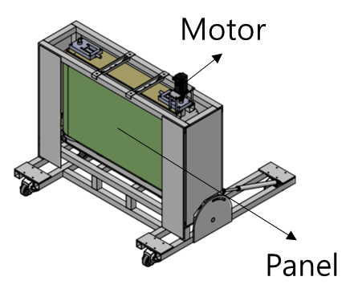{width="3.8125in" height="3.204861111111111in"}The HTMP device is shown in Fig. 1. The system is driven by a high-precision servo motor controlled through a programmable logic controller (PLC), and the panel moves along a rotational trajectory. This configuration enables velocity control in 10 km/h increments up to a maximum speed of 110 km/h. An Imatest® ISO 12233:2017 edge spatial frequency response (eSFR) test chart for MTF measurement can be mounted on the panel surface, as shown in Fig. 2.

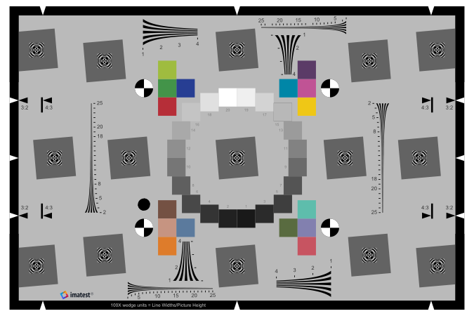{width="3.125in" height="2.0840496500437444in"}

B.  ***EXPERIMENTAL SETUP AND MEASUREMENT STANDARDS***

To ensure objectivity and reproducibility, an indoor testing environment was constructed in accordance with the ISO 12233 standard, as illustrated in Fig. 3. Image acquisition was conducted using a Phantom VEO4K Basler camera from KOMI equipped with a CMOS sensor with a native resolution of 4,096 × 2,304 pixels and a 25 mm prime lens; subsequent analyses are performed on a chart-aligned region-of-interest crop of 2,331 × 1,643 pixels that contains the eSFR ISO test target with a small surrounding margin. The distance between the camera and the HTMP panel was fixed at 1.5 meters. The aperture was set to F2.8 to maintain adequate depth of field. Illumination was provided by two 120 W daylight-balanced LED floodlights with a color temperature of 5,600 K positioned at 45° relative to the test chart, ensuring consistent illuminance levels of 15,000 lx and 40,000 lx.

For measurement of physical image quality characteristics, we used the Imatest® eSFR ISO test chart, which complies with the ISO 12233 standard for spatial frequency response (SFR) measurement of low-contrast edges. In addition to sharpness evaluation, the chart includes elements for assessing lateral chromatic aberration, white balance, tone response, color accuracy, and noise \[57\].

  ------------------------------------------------------------------------------------------------------------------------------------------------------------------
  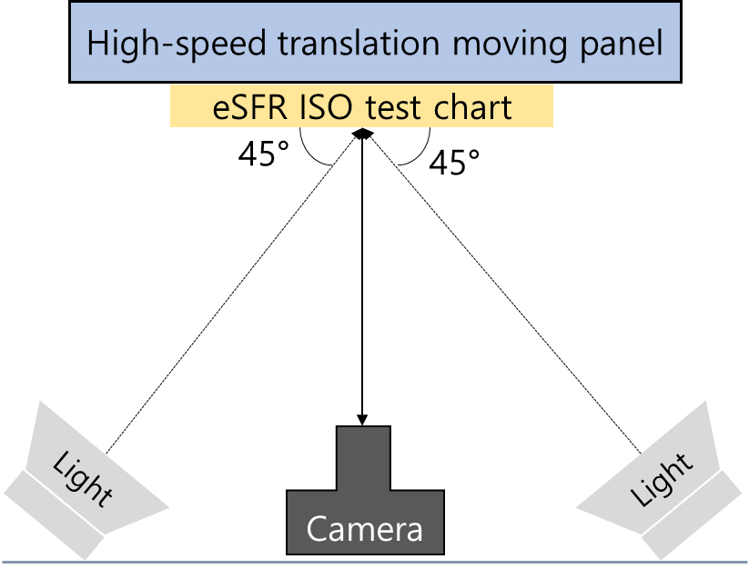{width="2.4in" height="1.825in"} (a)   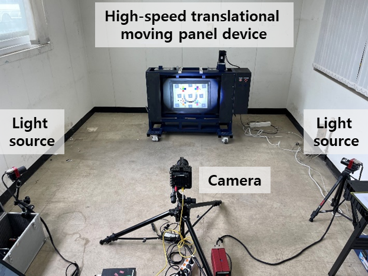{width="2.3305555555555557in" height="1.7472222222222222in"}(b)
  ------------------------------------------------------------------- ----------------------------------------------------------------------------------------------

  ------------------------------------------------------------------------------------------------------------------------------------------------------------------

The precision of this acquisition pipeline relies on the manufacturer-specified resolutions of the servo motor (10 km/h velocity command granularity through the PLC controller) and the Phantom VEO4K camera (global-shutter exposure ≥ 50 μs), together with the Imatest eSFR ISO 12233 protocol described above; direct profiling of the servo encoder and the shutter trigger latency was not performed in this study. Measurement repeatability of the full pipeline is therefore reported under the eight static (0 km/h) conditions of the HSMB dataset (Section III-C), where the across-condition mean and standard deviation of BEW are 3.33 ± 0.14 px, the within-condition repeated-frame standard deviation averages 0.15 px (≈ 4% of the static BEW mean), and MTF50 attains 0.163 ± 0.006 cy/px (3.7% relative standard deviation). These statistics establish a measurement noise floor against which the speed- and shutter-induced changes reported in Sections V and VI are interpreted, and a dedicated calibration campaign with direct encoder readout and shutter-latency profiling is identified as future work in Section VIII.

C.  ***CONSTRUCTION OF HSMB DATASET***

Using the custom-built HTMP device and the standardized experimental setup, we constructed the HSMB dataset. As shown in Table 2, data acquisition was performed by controlling three key variables: translational speed, camera shutter speed, and illumination level. The HTMP was operated at 0 km/h (static), 10 km/h, 30 km/h, 50 km/h, and 70 km/h. For each speed condition, shutter speeds were set to 50 μs, 100 μs, 250 μs, and 500 μs, and ISO sensitivity was adjusted to 640, 1,250, and 1,600 accordingly.

Table 2: Test conditions for capturing MB using moving panel and area scan camera

+-------------+---------------+----------+----------+----------+-------------+
| Panel speed | Shutter speed | ISO      | F-number | FPS      | Illuminance |
+=============+===============+==========+==========+==========+=============+
| 0 km/h      | 500 ㎲        | 640      | 2.8      | 100      | 15,000 lx   |
|             |               |          |          |          |             |
| 10 km/h     |               |          |          |          | 40,000 lx   |
|             |               |          |          |          |             |
| 30 km/h     |               |          |          |          |             |
|             |               |          |          |          |             |
| 50 km/h     |               |          |          |          |             |
|             |               |          |          |          |             |
| 70 km/h     |               |          |          |          |             |
|             +---------------+----------+          |          |             |
|             | 250 ㎲        | 1250     |          |          |             |
|             +---------------+----------+          |          |             |
|             | 100 ㎲        | 1600     |          |          |             |
|             +---------------+----------+          |          |             |
|             | 50 ㎲         | 1600     |          |          |             |
+-------------+---------------+----------+----------+----------+-------------+

Video footage captured by the HTMP included frames containing both the black background and the test chart. From each video, 30 images were extracted per test condition by selecting frames in which the entire test chart was visible, as illustrated in Fig 4.

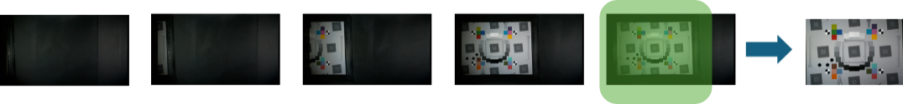{width="6.365277777777778in" height="1.1041666666666667in"}

The finalized HSMB dataset consists of 400 images generated from five speed conditions, four shutter speed settings, and two lighting conditions, with 10 images obtained for each condition. Each image contains four slanted edges on the eSFR ISO chart — two horizontal and two vertical — yielding 1,600 region-of-interest (ROI) measurements that anchor the directional BEW/MTF50 decomposition introduced in Section III-E. This dataset enables quantitative analysis of MB characteristics under high-speed translational movement and supports development and validation of the HSMB metric algorithm (Fig.5, Fig.6).

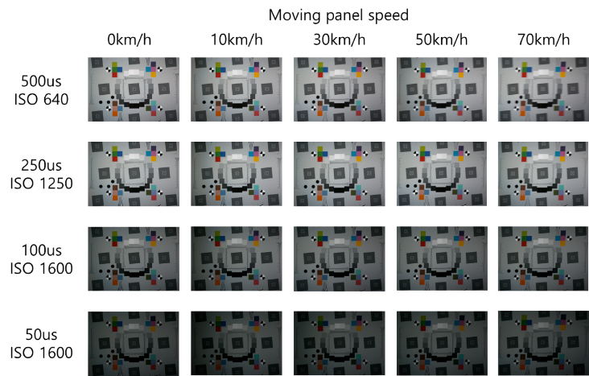{width="6.504166666666666in" height="4.1402777777777775in"}

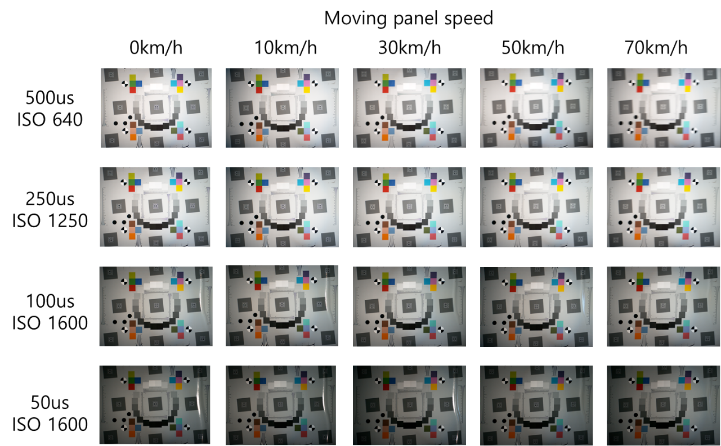{width="6.495138888888889in" height="4.017361111111111in"}

D.  ***MODULATION TRANSFER FUNCTION (MTF)***

The slanted-edge method defined in ISO 12233 measures SFR by analyzing an angled edge on a standardized test chart \[58\]. Figure 7 illustrates this procedure. In the eSFR ISO test chart, slanted edges are positioned between 5° and 7°, and the region of interest (ROI) is defined as a rectangular area crossing the short side of the edge, as shown in Fig. 7(a). Figure 7(b) presents the one-dimensional edge spread function (ESF), in which BEW represents the pixel width measured between the 10% and 90% rise distances of the ESF.

  --------------------------------------------------------------------------------------------------------------------------------------------------------------------------------------------------------------------------------------------------------------------------------
  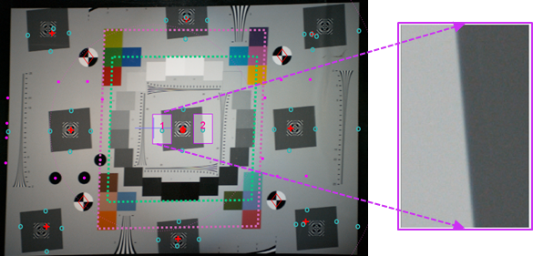{width="2.1347222222222224in" height="1.0256944444444445in"}(a)   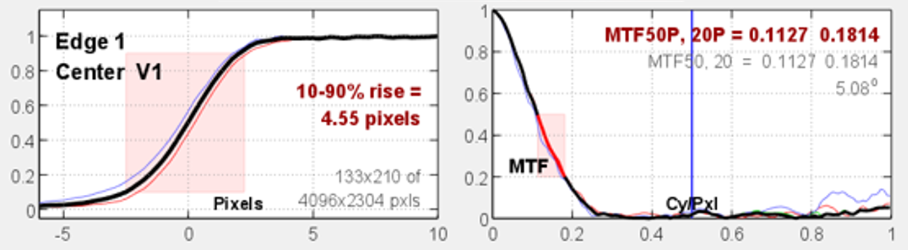{width="1.9125in" height="1.0430555555555556in"}(b)   {width="1.8659722222222221in" height="1.0430555555555556in"}(c)
  ---------------------------------------------------------------------------------------------- ---------------------------------------------------------------------------------- ----------------------------------------------------------------------------------------------

  --------------------------------------------------------------------------------------------------------------------------------------------------------------------------------------------------------------------------------------------------------------------------------

Figure 7: Illustration of slanted edge-based modulation transfer function (MTF) estimation process: (a) selection of a region of interest (ROI), (b) normalized edge spread function (ESF), and (c) estimated MTF

This approximation is obtained using a finite-difference filter and a Hamming window, followed by a discrete Fourier transform (DFT). The resulting normalized complex coefficients are used to estimate MTF, as shown in Fig. 7(c). MTF corresponds to the Fourier transform of the impulse response, which is the derivative of the edge response. In sampled imaging systems, MTF provides a reliable measure of image resolution and sharpness by indicating the level of detail that the camera can reproduce \[59\].

MTF50 denotes the spatial frequency at which contrast decreases to 50% of its low-frequency value, whereas MTF50P represents the frequency at which contrast decreases to 50% of its peak value \[60\]. Lower MTF values indicate reduced image quality. Koren \[61\] demonstrated that MTF50 values obtained using the Imatest® program strongly correlate with human-perceived sharpness.

  ------------------------ ---------------------- ---------------------

  ------------------------ ---------------------- ---------------------

Figure 8 presents the ROI defined in Fig. 7(a), corresponding to the slanted edge located at the center of the test chart. Figure 8(a) illustrates the ROI captured at the slowest shutter speed of 500 μs, whereas Fig. 8(d) shows the ROI obtained at the fastest shutter speed of 50 μs. Visual inspection indicates that MB increases with increasing HTMP speed and decreases as shutter speed becomes faster. However, although ISO sensitivity was increased to compensate for reduced exposure time, images captured at faster shutter speeds tend to appear darker.

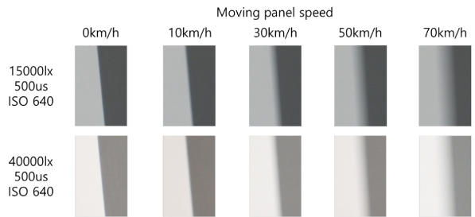{width="5.4in" height="2.46875in"}

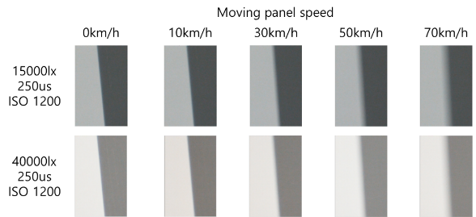{width="5.35625in" height="2.207638888888889in"}(a)

\(b\)

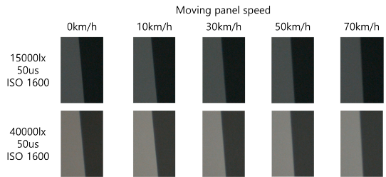{width="5.395833333333333in" height="2.2083333333333335in"}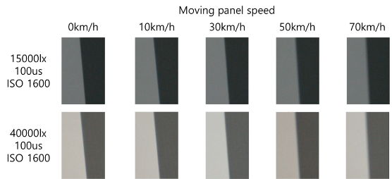{width="5.41875in" height="2.234722222222222in"}(c)

\(d\)

Figure 8: Comparison of MB and contrast of slanted-edge images between 15,000 lx and 40,000 lx: (a) shutter speed 500 ㎲, (b) shutter speed 250 ㎲, (c) shutter speed 100 ㎲, and (d) shutter speed 50 ㎲.

E.  ***DIRECTIONAL BEW AND MTF50 ANALYSIS*** *(new, 2026-04-22)*

The eSFR ISO test chart contains slanted edges at two orthogonal orientations, so that BEW and MTF50 can be measured independently along two image axes. We refer to the two reports as **horizontal MTF (H-axis)**, computed from a near-vertical edge that probes intensity variation along the image rows, and **vertical MTF (V-axis)**, computed from a near-horizontal edge that probes intensity variation along the image columns. For an MTSS panel translating horizontally relative to the camera, a translational motion-blur model predicts that blur will broaden the H-axis edge while leaving the V-axis edge essentially intact; the H/V decomposition therefore isolates the motion-induced component of blur from any motion-independent baseline such as sensor noise, residual vibration, or optical aberration.

For every Imatest ROI measurement, we record the edge orientation together with the corresponding BEW and MTF50 values. Per-frame statistics are then aggregated separately for each axis, and per-condition statistics are obtained by averaging over the frames of each condition. We denote the resulting condition-level quantities BEW_H, BEW_V, MTF50_H, and MTF50_V, and introduce the *anisotropy diagnostic* Δ ≡ BEW_H − BEW_V, which summarises the motion-only contribution to blur with the motion-independent baseline removed. Positive Δ indicates motion-dominant blur; near-zero Δ indicates an isotropic degradation such as defocus.

Empirical results obtained by applying this decomposition are reported separately: the laboratory H/V statistics and the associated anisotropy are presented in Section V-A, and the same protocol is applied to the area-scan field dataset in Section VI-A. The anisotropy diagnostic Δ is used throughout the remainder of the paper to interpret both design-space blur (Sections V and VI) and out-of-design-space failure modes such as the complex-blur condition discussed in Section VI-D.

> **한글 버전**: [ko/03_hsmb_dataset.md](ko/03_hsmb_dataset.md)

## 수정 메모 (Revision Notes)

> Laboratory dataset 본문은 유지. §III-E (Directional BEW/MTF Analysis) 신규 추가.

### 완료 (2026-04-22)

- [x] **§III-E 신규 서브섹션** — H/V 축 분리 분석 *방법론*으로 축소 (영문·한글)
  - H축/V축 의미 정의, 프레임별→조건별 집계 프로토콜
  - 이방성 diagnostic Δ = BEW_H − BEW_V 정의
  - 결과(V축 상수, H축 속도 비례, Δ peak +33.4 px)는 **§V-A로 이동** — 방법은 §III, 결과는 §V의 표준 IMRaD 구조 준수
- [x] §V-A에 H/V 분해 결과 문단 추가 (영문·한글)
- [x] §IV-D 파라미터 근거에서 §III-E 참조 가능 (cross-link 정합성 확보)
- [x] §VI에서 동일 Δ diagnostic 재사용 명시

### 보류

- [ ] Figure 8(e) 신규 — 이방성 격자 시각화 (현재 results/lab/figures/labFig_anisotropy_heatmap.png 활용 가능)
- [ ] 필요 시 area-scan/line-scan 블러 메커니즘 비교 문단 추가 (R01 맥락 강화) — Introduction Para 3에 이미 언급
- [ ] Table 1의 "area scan camera" 명시 강조 (현장 실험과의 일관성 논거)
