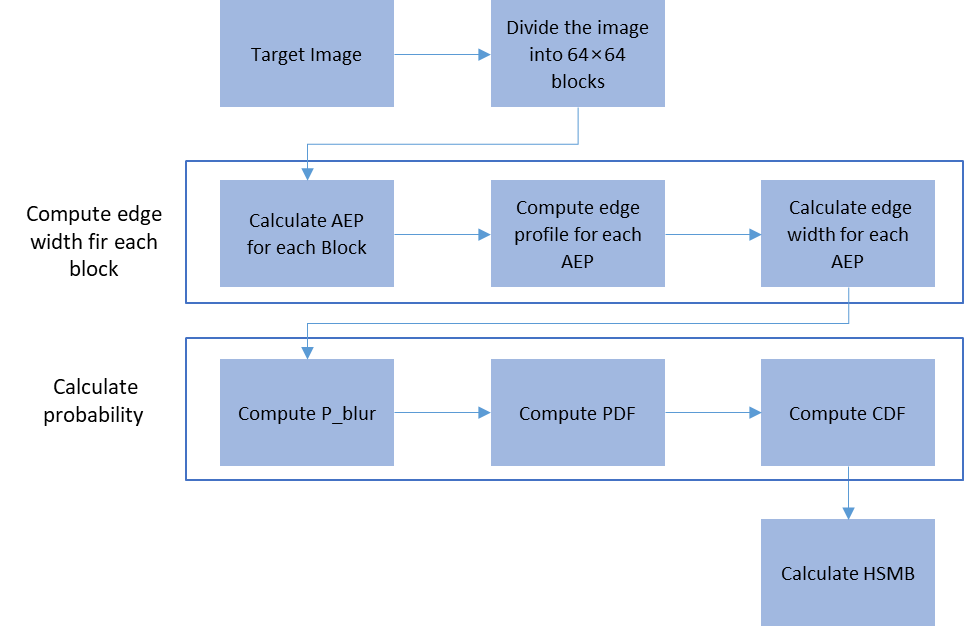
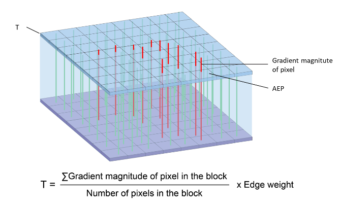
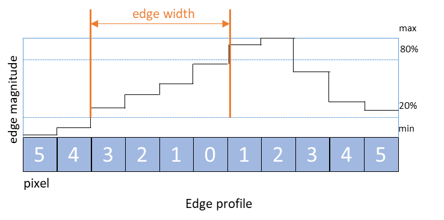
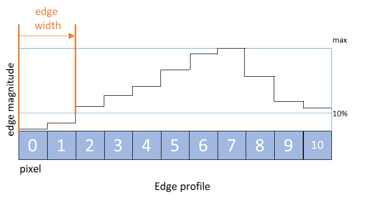

# Section IV — PROPOSED NO-REFERENCE IMAGE QUALITY ASSESSMENT

> **Source**: `paper/original/Revision_0224.docx`
> **Revision date**: 2026-02-24
> **Mapping**: `full_manuscript.md` lines 157–250
> **Status**: **§IV-D, §IV-E 신규 서브섹션 추가 완료 (2026-04-22)** — R04 대응 (Reviewer C4). §IV-A/B/C는 원본 유지. ablation 결과 수치는 원본 이미지 수령 후 업데이트

---

IV. **PROPOSED NO-REFERENCE IMAGE QUALITY ASSESSMENT**

<!-- -->

A.  ***MOTIVATION FOR HSMB METRIC AND LIMITATIONS OF EXISTING NR-IQA***

Accurate evaluation of MB in high-speed imaging is essential for maintaining image quality and improving defect detection reliability in applications such as tunnel inspection. However, most existing no-reference image quality assessment (NR-IQA) metrics were developed for general image quality evaluation and are not optimized for MB characteristics specific to high-speed environments.

For example, Blind/Referenceless Image Spatial Quality Evaluator (BRISQUE) \[45\] and Naturalness Image Quality Evaluator (NIQE) \[62\] are based on Natural Scene Statistics (NSS) models. Although these metrics perform well for common distortions such as JPEG compression artifacts, noise, and generic blur, they are less effective in capturing the statistical properties of MB in MTSS environments, where blur is directionally biased and varies in intensity. Because these models are trained on datasets containing predefined distortion types, their adaptability to environments with distinct blur characteristics is limited.

Perceptual Image Quality Evaluator (PIQE) \[64\] assesses image quality using block-based feature extraction and machine learning classification. However, MB in high-speed settings is often spatially non-uniform and directionally dependent. Block-based methods have difficulty representing fine-grained spatial variations and directional blur patterns, reducing their effectiveness in estimating overall blur severity.

Cumulative Probability of Blur Detection (CPBD) \[64\] evaluates blur by analyzing luminance variations at edges detected through the Canny filter. This approach is suitable for detecting structural defects such as cracks in infrastructure images. CPBD incorporates the concept of Just Noticeable Blur (JNB), which identifies the minimum BL perceptible near edges under contrast conditions exceeding Just Noticeable Difference (JND). It primarily assesses globally uniform blur using cumulative probability \[65\]. However, its performance may decline when images contain localized or complex blur patterns \[66\].

Overall, general-purpose NR-IQA metrics, including BRISQUE, NIQE, and PIQE, do not fully represent HSMB characteristics. Although CPBD is applicable in certain structural inspection contexts, its reliance on edge detection may reduce accuracy under specific conditions. Because MB in high-speed environments such as MTSS differs substantially from common distortions, development of a dedicated NR-IQA metric tailored to these conditions is necessary.

To address these limitations, this study proposes the HSMB metric, a novel NR-IQA method designed to improve the reliability of image quality assessment in MTSS environments by capturing the distinctive characteristics of high-speed motion blur. The metric incorporates an approach that increases sensitivity to edge variations and enables more robust estimation of blur severity. Ultimately, it aims to reduce defect detection errors caused by MB.

B.  ***OVERVIEW OF HSMB METRIC***

The HSMB metric is based on the active edge pixel (AEP) approach. Unlike conventional methods such as CPBD, which rely on traditional edge detectors, including the Canny filter and may yield unreliable blur estimation when edge information is incomplete or incorrectly identified, HSMB avoids such detectors. Instead, it directly analyzes image gradient magnitudes to quantify blur. This design reduces the influence of cracks and noise in tunnel images and supports more stable measurement of blur severity. HSMB identifies blur by detecting abrupt intensity variations in edge regions and quantifies blur spread within these regions to generate a final score. The algorithmic block diagram of the HSMB metric is shown in Fig. 9.

{width="4.825694444444444in" height="3.1333333333333333in"}Figure 9: Block diagram of HSMB metric

The overall HSMB process proceeds as follows:

1.  To account for local image characteristics, the input image is divided into 64 × 64 blocks. This partitioning enables detection of fine edge details across the image. Block-based analysis, including computation of local averages, is commonly applied in NR-IQA methods such as BRISQUE and allows the metric to respond to localized image variations.

2.  {width="4.3909722222222225in" height="2.147222222222222in"}For each pixel within a block, vertical (x-direction) and horizontal (y-direction) gradients are calculated using the Sobel operator. The gradient vector magnitude is computed to represent edge strength. The mean edge strength of all pixels in the block is multiplied by a weighting factor (Edge Weight) to determine the threshold value T, as defined in equation (1). Pixels with edge strength greater than T are selected as AEPs for blur assessment. Based on tunnel image experiments, Edge Weight was empirically set to 1.5 so that approximately the top 75% of gradient magnitudes are classified as AEPs (see Fig. 10).

Figure 10: AEP selection example

$$T\;=\;w_{e}\cdot\langle G\rangle,\qquad w_{e}=1.5\tag{1}$$

where $\langle G\rangle = \frac{1}{|B|}\sum_{p\in B} G(p)$ is the mean Sobel gradient magnitude over the 64×64 block $B$, $G(p)=\sqrt{G_{x}(p)^{2}+G_{y}(p)^{2}}$, and $w_{e}$ is the Edge Weight (default 1.5; see §IV-D).

3.  The edge direction of each AEP is determined by identifying the direction of maximum intensity variation among its neighboring pixels. Although CPBD computes edge direction as a continuous value in radians, the proposed method simplifies computation by restricting direction to four principal orientations (0°, 90°, 180°, 270°), with optional inclusion of diagonal orientations (45°, 135°, 225°, 315°) as additional parameters.

4.  {width="2.7416666666666667in" height="1.4083333333333334in"}{width="2.6430555555555557in" height="1.4722222222222223in"}An intensity profile is sampled perpendicular to the edge at each AEP along its quantized gradient orientation, spanning a symmetric window of $2r+1$ pixels (default walk-radius $r = 8$, i.e. 17 samples) centered on the AEP. Unlike conventional ESF-based methods, which define edge width as the pixel interval between 20% and 80% of intensity variation (see Fig. 11(a)), the proposed method localises the edge transition by a **monotonicity walk** combined with sub-pixel **3-point parabolic refinement** (see Fig. 11(b)). Starting at the centre of the profile, the walk extends outward in both directions, terminating on each side at the first non-monotonic step — the local intensity extremum that brackets the edge transition. The two endpoints are then refined to sub-pixel precision via a 3-point parabolic fit on the discrete profile values, and the edge width $w(e_i)$ is taken as the distance between the two refined endpoints. This monotonicity-based localisation is more robust to noise than ESF-based methods, where low-intensity variations may be incorrectly interpreted as blur, while the parabolic sub-pixel refinement preserves the discriminative power of the metric below the integer-pixel grid.

> \(a\) (b)
>
> Figure 11: Method of edge-width estimation: (a) Edge width estimation from ESF and (b) Edge width estimation in HSMB

  -------------------- -------------------

  -------------------- -------------------

5.  Next, the probability of blur $P_{\text{blur}}(e_{i})$ for a given AEP $e_{i}$ is calculated using equation (2). Based on the theoretical analysis of §IV-D, the JNB value was set to 3, and the Weibull shape parameter $\beta$ was fixed at 2 (Rayleigh) for all experiments.

$$P_{\text{blur}}(e_{i})\;=\;1-\exp\!\left[-\left(\frac{w(e_{i})}{\text{JNB}}\right)^{\beta}\right]\tag{2}$$

where $w(e_{i})$ is the sub-pixel edge width of AEP $e_{i}$ obtained by the EVP interpolation in step 4. Equation (2) is the Weibull cumulative distribution function with scale $\text{JNB}$ and shape $\beta$, which reduces to the Rayleigh form at $\beta=2$ (see §IV-D for the theoretical justification).

The blur probability $P_{\text{blur}}(e_{i})$ ranges between 0 and 1. The final HSMB score is computed using equation (3), where the perceptual threshold $P_{\text{jnb}}$ is set to 0.63.

$$\text{HSMB}\;=\;F_{P_{\text{blur}}}(P_{\text{jnb}}),\qquad P_{\text{jnb}}=0.63\tag{3}$$

Here, $F_{P_{\text{blur}}}(\cdot)$ denotes the empirical cumulative distribution function (CDF) of the per-AEP blur probabilities $\{P_{\text{blur}}(e_{i})\}_{i=1}^{N_{\text{AEP}}}$ across the entire image, and $F_{P_{\text{blur}}}(P_{\text{jnb}})$ returns the fraction of AEPs whose blur probability does not exceed $P_{\text{jnb}}$. In practice, the HSMB value is obtained by constructing the CDF from the empirical distribution of $P_{\text{blur}}$ values and evaluating it at $P_{\text{jnb}} = 0.63$. This convention yields HSMB ∈ [0, 1], with higher values indicating sharper images: a sharp image concentrates $P_{\text{blur}}$ near zero, so a larger fraction lies below the threshold.

The complete HSMB pipeline is summarised in Algorithm 1, which consolidates the five steps of §IV-B together with equations (1)–(3) into a single self-contained procedure suitable for direct reproduction.

**Algorithm 1: HSMB metric**

```
Input :  image I (grayscale or luminance channel of an RGB image)
         hyperparameters (w_e, JNB, β, P_jnb) = (1.5, 3, 2, 0.63)
         block size N_b = 64
Output:  HSMB score in [0, 1] (higher = sharper)

 1: AEP ← ∅                                    // active edge pixel set
 2: Partition I into non-overlapping N_b × N_b blocks {B_k}
 3: for each block B_k do
 4:    G_x, G_y ← Sobel gradients of B_k
 5:    G(p) ← sqrt(G_x(p)² + G_y(p)²)          for all p ∈ B_k
 6:    ⟨G⟩_k ← mean of G(p) over B_k
 7:    T_k ← w_e · ⟨G⟩_k                       // Eq. (1)
 8:    AEP ← AEP ∪ {p ∈ B_k : G(p) > T_k}
 9: end for
10: P ← ∅                                      // blur-probability set
11: for each e_i ∈ AEP do
12:    Quantize gradient direction θ(e_i) to 4 bins {0°, 45°, 90°, 135°}
13:    Sample perpendicular profile of 2r+1 pixels (r = 8) centered on e_i
14:    Walk outward from centre in both directions until first non-monotonic step
15:    Refine left/right endpoints via 3-point parabolic fit (sub-pixel)
16:    w(e_i) ← |right_refined − left_refined|
17:    P_blur(e_i) ← 1 − exp(−(w(e_i)/JNB)^β)  // Eq. (2)
18:    P ← P ∪ {P_blur(e_i)}
19: end for
20: F ← empirical CDF of P
21: HSMB ← F(P_jnb)                            // Eq. (3); HSMB ∈ [0, 1]
22: return HSMB
```

A reference implementation is available in `scripts/hsmb_metric.py` of the project repository. Per-image FLOPs and inference time, measured on a dedicated benchmarking environment by the implementation team, will be reported once the runtime characterisation campaign is complete.

C.  ***SENSITIVITY ANALYSIS***

The HSMB metric depends on three key parameters summarized in Table 2, and its final output is determined by their combined influence. To evaluate the contribution of each parameter to the HSMB output, a sensitivity analysis was performed using Sobel sensitivity indices \[67\].

Table 2: Parameters used for sensitivity analysis

  ---------------------------------------------------------------------------------------------------------------------------------------------------------------------------------------------------------------------------------------------------------------------------------------------------------------------------------------------------------------------------------------------------------------
  Parameter         Range                          Explanation
  ----------------- ------------------------------ --------------------------------------------------------------------------------------------------------------------------------------------------------------------------------------------------------------------------------------------------------------------------------------------------------------------------------------------------------------
  Edge Weight       1.0, 1.1, 1.2, 1.3, 1.4, 1.5   Applied to the average edge magnitude of all pixels in a block; used to determine which pixels qualify as AEPs.

  Threshold Ratio   0.3, 0.4, 0.5, 0.6             After identifying AEPs, the edge profile is constructed by selecting the direction with the highest pixel intensity change among 4 or 8 neighboring directions. This parameter serves as a weighting factor when tracking changes in pixel intensity along the edge profile, up to the point where the intensity change first exceeds a specified threshold.

  Direction         4-direction, 8-direction       Determines how many directions are explored when constructing the edge profile.
  ---------------------------------------------------------------------------------------------------------------------------------------------------------------------------------------------------------------------------------------------------------------------------------------------------------------------------------------------------------------------------------------------------------------

Table 4 summarizes the sensitivity analysis results, presenting the Total Sensitivity Index (TSI) values for Edge Weight (0.223), Direction (0.219), and Threshold Ratio (0.208). All parameters exhibit TSI values greater than 0.2, with confidence intervals below 0.01, indicating that each parameter meaningfully influences HSMB output and that the estimates are statistically stable. Among the three parameters, Edge Weight shows the highest sensitivity. This result reflects its central role in AEP selection, as identification of AEPs directly determines which pixels contribute to HSMB score computation. Consequently, the Edge Weight parameter exerts a substantial influence on the final metric value.

Table 3: Sensitivity analysis results

  -------------------------------------------------------------------------
  Parameter               Total Sensitivity index   Confidence interval
  ----------------------- ------------------------- -----------------------
  Edge Weight             0.223140                  0.008082

  Threshold Ratio         0.208265                  0.007261

  Direction               0.218918                  0.005994
  -------------------------------------------------------------------------

D.  ***PARAMETER SELECTION AND THEORETICAL BASIS*** *(new, 2026-04-22 — R04 response)*

The HSMB metric involves three hyperparameters — Edge Weight, JNB, and β — with default values of 1.5, 3, and 2, respectively. Each default is motivated by a well-established statistical or perceptual model of natural-image edges. The Sobol sensitivity analysis of Section IV-C shows that all three parameters meaningfully influence the HSMB output; the present subsection establishes *why* the chosen defaults are theoretically principled, and Section IV-E quantifies the resulting correlation with the physical ground-truth indicators.

*1) Edge Weight (default = 1.5): Generalized Gaussian model of natural-image gradients.*
Natural-image gradient magnitudes are well modelled by the Generalized Gaussian Distribution (GGD) [75], which is heavy-tailed with a concentration of small gradients near zero and a long tail of strong edges. This observation has become a cornerstone of natural-scene-statistics-based NR-IQA such as BRISQUE [43]. In HSMB, the block-mean gradient G̅ represents the bulk of the distribution, while active edge pixels (AEPs) correspond to the tail. Setting the threshold T = 1.5 × G̅ selects approximately the top 75 % of gradient magnitudes as AEPs (Fig. 10), retaining physically meaningful edges while excluding near-zero gradients that carry mostly noise. Values below 1.5 admit noise into the AEP set; values above 1.5 discard weak but informative edges.

*2) JNB (default = 3): Just Noticeable Blur at suprathreshold contrast.*
The Just Noticeable Blur (JNB) concept, introduced by Ferzli and Karam [65], models the minimum edge-width change that a human observer can perceive when the contrast exceeds the Just Noticeable Difference (JND). For suprathreshold contrast at standard viewing geometry, the JNB has been estimated to lie in the range of 3–5 pixels [65]. In HSMB, the JNB parameter sets the edge-width scale beyond which the per-edge blur probability P_blur(e_i) saturates. We adopt the lower end of the reported range (JNB = 3), which provides a stringent early-detection threshold: an edge is already flagged as perceivably blurred once its width exceeds 3 pixels. Larger values delay this saturation and reduce sensitivity to mild motion blur, which is undesirable for a metric intended to pre-filter images for downstream CNN detectors.

*3) β (default = 2): Weibull shape for motion-induced edge-width distribution.*
The Weibull family has been established as a compact descriptor of natural-image texture and edge-width statistics, notably in the six-stimulus texture theory [76]. Its shape parameter β governs how rapidly the edge-width distribution decays from the modal value. The special case β = 2 corresponds to the Rayleigh distribution, which is the canonical model for the radial magnitude of a pair of zero-mean Gaussian components — precisely the regime that arises when an edge-width distribution is generated by a Gaussian optical point-spread function convolved with translational motion. Setting β = 2 therefore aligns the HSMB blur-probability curve with the Rayleigh-shaped edge-width distribution expected under motion blur. Values β < 2 produce a softer, sub-Rayleigh shape that under-penalises moderately blurred edges; values β > 2 over-sharpen the curve and lose sensitivity to intermediate blur levels.

Table 3 (new) summarises these three theoretical grounds and the corresponding defaults.

**Table 3 (new): Theoretical basis of the HSMB hyperparameters.**

| Parameter   | Default | Theoretical basis                                               | Reference    |
|:-----------:|:-------:|:----------------------------------------------------------------|:------------:|
| Edge Weight | 1.5     | GGD model of natural-image gradients; heavy tail at 1.5 × G̅    | [75], [43]   |
| JNB         | 3       | Just Noticeable Blur under suprathreshold contrast               | [65]         |
| β           | 2       | Rayleigh shape of motion-induced edge-width distribution         | [76]         |

E.  ***ABLATION STUDY*** *(new, 2026-04-22 — R04 response)*

To empirically verify the three theoretical defaults, we sweep each hyperparameter independently while holding the others at their default values and measure the correlation between the HSMB metric and the two physical ground-truth indicators (BEW, MTF50) on the laboratory HSMB dataset of Section III. The sweep ranges are motivated by the theoretical analysis of Section IV-D and by the Sobol sensitivity results of Section IV-C.

*Sweep ranges.*
- Edge Weight: {1.0, 1.25, 1.5, 1.75, 2.0}
- JNB: {1, 2, 3, 4, 5}
- β: {1.0, 1.5, 2.0, 2.5, 3.0}

For each setting, the HSMB score is recomputed on all 320 laboratory images (20 conditions × ≈ 10 frames), and the Pearson linear correlation coefficient (PLCC), Spearman rank-order correlation coefficient (SROCC), and Kendall rank-order correlation coefficient (KRCC) are reported against both BEW and MTF50, with the two slant-edge orientations (horizontal-MTF and vertical-MTF, see §III-E) reported separately.

*Expected outcome and paper integration.*
Under the theoretical defaults, we expect PLCC to peak at (Edge Weight, JNB, β) = (1.5, 3, 2), with monotonic or near-monotonic degradation toward both ends of each sweep. A peak at or adjacent to the default would provide direct empirical confirmation of the theoretical grounding in Section IV-D.

> **Results pending.** Tables 4 (Edge Weight sweep), 5 (JNB sweep), and 6 (β sweep), together with Figure 10 (three sensitivity curves, one panel per parameter with the theoretical default annotated), will be populated once the HSMB metric is recomputed on the laboratory dataset for each sweep value using `scripts/ablation_study.py`. The ground-truth tables (Tables 4a–4b, 5a–5b of Section V) and the directional BEW/MTF50 analysis of Section III-E already provide the reference values required for these correlations.

> **한글 버전**: [ko/04_proposed_nr_iqa.md](ko/04_proposed_nr_iqa.md)

## 수정 메모 (Revision Notes)

> **핵심 수정 구역 — Reviewer C4 대응 (R04)**

### 신규 서브섹션 추가 — 완료 (2026-04-22)

- [x] **§IV-D. PARAMETER SELECTION AND THEORETICAL BASIS** (신규 작성 완료)
  - [x] Edge Weight = 1.5: GGD 이론 근거 ([75] Sharifi & Leon-Garcia)
  - [x] JNB = 3: Ferzli & Karam 원논문 ([65]) + suprathreshold 설명
  - [x] β = 2: Weibull/Rayleigh 분포 ([76] Geusebroek & Smeulders) + motion PSF 해석
  - [x] Table 3 (신규): 3 파라미터 × 이론근거 × 참조 요약
- [x] **§IV-E. ABLATION STUDY** (신규 골격 완료)
  - [x] Sweep 범위·방법론 서술
  - [x] 예상 결과 및 논문 통합 계획
  - [ ] Table 4/5/6 (Edge Weight/JNB/β sweep 결과) — **원본 이미지 수령 후 `scripts/ablation_study.py`로 산출 예정**
  - [ ] Figure 10 (3-panel sensitivity curves) — ablation 결과 후 생성
- [x] 참조 문서 연계: [parameter_justification.md](../../00_doc/sp00/parameter_justification.md)
- [x] 한글 버전 동기화 (ko/04_proposed_nr_iqa.md)

### 기존 내용 수정

- [ ] §IV-B step 2: Edge Weight=1.5 설정 근거를 "empirically set"에서 **"theoretically motivated + empirically validated"**로 전환
- [ ] §IV-B step 5: JNB=3, β=2 설정 근거 보강 (§IV-D로 연결)
