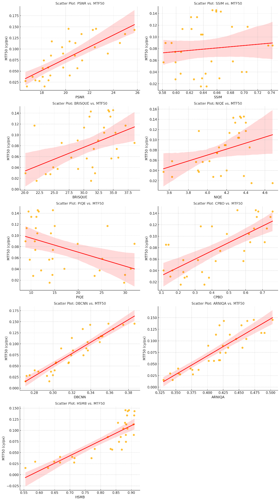
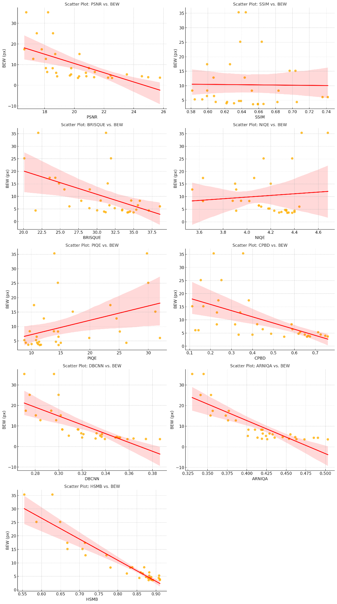

# Section V — EXPERIMENTAL RESULTS AND ANALYSIS

> **Source**: `paper/original/Revision_0224.docx`
> **Revision date**: 2026-02-24
> **Mapping**: `full_manuscript.md` lines 251–416
> **Status**: **재작성 초안 v06 (2026-04-29)** — §V-A Tables 4/5 H/V 축 분리 통합표 + §V-B 9-지표 상관분석(통계검증) + §V-C 산점도 분석(H/V 축별, 새 PNG 채택) 신설 + §V-D 공개 데이터셋 본문 보강(인트로 + 3 paragraph 해석으로 §V-B 결과와 인과 연결). §V-E는 Task B 결과 대기. 원본은 하단 "## 원본 (참조용)" 섹션에 보존

---

## 재작성 초안 v02 (2026-04-21) — 표 재포맷

> 본 초안은 원본 Tables 4–8의 pandoc pipe-style nested 표를 **읽기 쉬운 matrix 형태**로 재배치한 것입니다. 수치·내용은 원본과 동일.

### V-A. Laboratory ground-truth measurements (BEW / MTF50)

**Table 4: Laboratory HSMB dataset — condition-level BEW and MTF50 under 15,000 lx illuminance, decomposed into motion-aligned (H) and cross-motion (V) axes.** The H-axis row of each shutter group reproduces the single-axis values reported in the original publication; the V-axis row is added as part of the directional analysis introduced in Section III-E.

**Table 4(a). BEW (pixels) — 15,000 lx, by axis**

| Shutter | Axis |  0 km/h |  10   |   30  |   50  |   70  |
|:-------:|:----:|:-------:|:-----:|:-----:|:-----:|:-----:|
| **500 μs** | **H** |  3.41 | 6.31 | 16.39 | 27.62 | 38.30 |
|            | **V** |  3.02 | 3.04 |  3.48 |  4.10 |  4.87 |
| **250 μs** | **H** |  3.61 | 4.69 |  8.79 | 13.84 | 19.00 |
|            | **V** |  3.06 | 3.18 |  3.17 |  3.34 |  3.66 |
| **100 μs** | **H** |  3.58 | 3.87 |  4.74 |  6.37 |  8.46 |
|            | **V** |  3.02 | 3.11 |  3.02 |  3.01 |  3.23 |
|  **50 μs** | **H** |  3.36 | 3.68 |  3.92 |  4.50 |  5.30 |
|            | **V** |  2.94 | 3.09 |  3.04 |  2.99 |  3.14 |

**Table 4(b). MTF50 (cy/px) — 15,000 lx, by axis**

| Shutter | Axis |  0 km/h  |   10   |   30   |   50   |   70   |
|:-------:|:----:|:-------:|:------:|:------:|:------:|:------:|
| **500 μs** | **H** | 0.1565 | 0.0754 | 0.0290 | 0.0180 | 0.0132 |
|            | **V** | 0.1749 | 0.1721 | 0.1474 | 0.1213 | 0.0989 |
| **250 μs** | **H** | 0.1482 | 0.1073 | 0.0538 | 0.0343 | 0.0251 |
|            | **V** | 0.1702 | 0.1648 | 0.1644 | 0.1544 | 0.1385 |
| **100 μs** | **H** | 0.1500 | 0.1413 | 0.1039 | 0.0750 | 0.0562 |
|            | **V** | 0.1737 | 0.1712 | 0.1750 | 0.1735 | 0.1614 |
|  **50 μs** | **H** | 0.1584 | 0.1491 | 0.1327 | 0.1119 | 0.0920 |
|            | **V** | 0.1791 | 0.1711 | 0.1722 | 0.1757 | 0.1701 |

---

**Table 5: Laboratory HSMB dataset — condition-level BEW and MTF50 under 40,000 lx illuminance, decomposed by axis.**

**Table 5(a). BEW (pixels) — 40,000 lx, by axis**

| Shutter | Axis |  0 km/h |  10   |   30  |   50  |   70  |
|:-------:|:----:|:-------:|:-----:|:-----:|:-----:|:-----:|
| **500 μs** | **H** |  3.24 | 6.10 | 15.17 | 25.22 | 35.38 |
|            | **V** |  3.15 | 3.01 |  3.22 |  3.74 |  4.46 |
| **250 μs** | **H** |  3.52 | 4.39 |  8.31 | 12.81 | 17.43 |
|            | **V** |  3.60 | 3.52 |  3.62 |  3.76 |  4.03 |
| **100 μs** | **H** |  3.50 | 3.62 |  4.79 |  6.48 |  8.39 |
|            | **V** |  3.42 | 3.44 |  3.44 |  3.52 |  3.61 |
|  **50 μs** | **H** |  3.44 | 3.64 |  3.92 |  4.46 |  5.31 |
|            | **V** |  3.42 | 3.42 |  3.44 |  3.43 |  3.49 |

**Table 5(b). MTF50 (cy/px) — 40,000 lx, by axis**

| Shutter | Axis |  0 km/h  |   10   |   30   |   50   |   70   |
|:-------:|:----:|:-------:|:------:|:------:|:------:|:------:|
| **500 μs** | **H** | 0.1701 | 0.0798 | 0.0321 | 0.0205 | 0.0155 |
|            | **V** | 0.1768 | 0.1737 | 0.1582 | 0.1334 | 0.1092 |
| **250 μs** | **H** | 0.1582 | 0.1152 | 0.0580 | 0.0379 | 0.0280 |
|            | **V** | 0.1565 | 0.1566 | 0.1517 | 0.1436 | 0.1302 |
| **100 μs** | **H** | 0.1569 | 0.1459 | 0.1035 | 0.0741 | 0.0566 |
|            | **V** | 0.1573 | 0.1580 | 0.1563 | 0.1524 | 0.1479 |
|  **50 μs** | **H** | 0.1592 | 0.1466 | 0.1342 | 0.1130 | 0.0901 |
|            | **V** | 0.1579 | 0.1551 | 0.1537 | 0.1545 | 0.1529 |

*Three observations are evident from Tables 4 and 5. First, the H-axis (motion-aligned) BEW grows with the product of vehicle speed and exposure time, rising from ≈ 3.4 px at 0 km/h to ≈ 38 px at 70 km/h with a 500 μs shutter — an order-of-magnitude increase that is approximately proportional to speed × exposure time, in agreement with the geometric model of translational motion blur — and the corresponding H-axis MTF50 falls by an order of magnitude. Second, the V-axis (cross-motion) BEW is approximately constant across all 40 conditions, remaining within 2.94–4.87 px (grand mean ≈ 3.6 px) and changing by less than 1 px between the slowest (0 km/h) and fastest (70 km/h) speeds at any given shutter; the V-axis MTF50 is similarly insensitive to speed, establishing a motion-independent reference axis that any directionally faithful NR-IQA metric must respect. Third, both illuminance levels show the same monotonic H/V pattern, confirming BEW and MTF50 as reliable axis-resolved ground-truth indicators of high-speed motion blur.*

**Anisotropy diagnostic.** The signed difference Δ = BEW_H − BEW_V directly quantifies the directional imbalance produced by translational motion: Δ ≈ 0 px at static or short-shutter conditions and reaches a peak of +33.4 px at the (500 μs, 70 km/h, 15,000 lx) cell of Table 4(a), with a near-monotonic growth pattern that holds for both illuminance levels. The full per-condition statistics, including standard deviations and per-frame BEW/MTF50 distributions, are available in `results/lab/gt_summary.md`. The same Δ statistic is reused as a stress-test diagnostic for the area-scan field dataset of Section VI, where non-translational blur components (vibration, focus drift, stitching errors) are expected to inflate V-axis BEW relative to the laboratory baseline established here.

---

### V-B. Correlation of NR/FR-IQA metrics with directional blur indicators (40 laboratory conditions)

The directional decomposition of Section V-A yields four ground-truth statistics per condition — BEW_H, BEW_V, MTF50_H, and MTF50_V — that distinguish motion-aligned (H) from cross-motion (V) blur behaviour. We correlate nine IQA metrics — two full-reference baselines (SSIM, PSNR), four traditional NR baselines (CPBD, BRISQUE, NIQE, PIQE), two state-of-the-art deep-learning NR baselines (DBCNN, ARNIQA), and the proposed HSMB — against each of these four targets at the condition level (N = 40 for all NR metrics; N = 32 for SSIM and PSNR, which are undefined for the eight static reference conditions at 0 km/h). Statistical significance is established with a two-sided permutation test (n_perm = 10,000) on |r|, and 95% percentile bootstrap confidence intervals (n_boot = 10,000) are reported for each coefficient (random seed = 42). Tables 6 and 7 summarise the results.

**Table 6: Correlation between BEW (motion-blur edge width) and NR/FR-IQA metrics, decomposed by axis (N = 40 for NR metrics; N = 32 for FR metrics excluding 0 km/h reference).** Bold marks the strongest |coefficient| within each axis among NR-IQA methods. Significance from two-sided permutation test: \*p<0.05, \*\*p<0.01. Bootstrap 95% CIs available in `results/lab/tables/table6_bew_correlations.md`.

| Metric (category)        |  N (H) | PLCC (H)     | SROCC (H)    | KRCC (H)     |  N (V) | PLCC (V)     | SROCC (V)    | KRCC (V)     |
|:-------------------------|:------:|:------------:|:------------:|:------------:|:------:|:------------:|:------------:|:------------:|
| SSIM (FR)                |   32   | +0.437\*     | +0.349\*     | +0.210       |   32   | +0.314       | +0.292       | +0.212       |
| PSNR (FR)                |   32   | −0.654\*\*   | −0.806\*\*   | −0.609\*\*   |   32   | −0.672\*\*   | −0.769\*\*   | −0.587\*\*   |
| CPBD (NR sharpness)      |   40   | −0.822\*\*   | −0.938\*\*   | −0.808\*\*   |   40   | −0.582\*\*   | −0.479\*\*   | −0.350\*\*   |
| BRISQUE (NR NSS)         |   40   | −0.206       | −0.079       | −0.018       |   40   | −0.327\*     | −0.415\*\*   | −0.284\*     |
| NIQE (NR NSS)            |   40   | −0.128       | −0.003       | +0.026       |   40   | −0.207       | −0.178       | −0.101       |
| PIQE (NR NSS)            |   40   | +0.594\*\*   | +0.637\*\*   | +0.505\*\*   |   40   | +0.331\*     | +0.201       | +0.137       |
| DBCNN (NR DL)            |   40   | −0.707\*\*   | −0.928\*\*   | −0.779\*\*   |   40   | −0.443\*\*   | −0.415\*\*   | −0.286\*     |
| ARNIQA (NR DL)           |   40   | −0.775\*\*   | −0.882\*\*   | −0.736\*\*   |   40   | −0.545\*\*   | −0.444\*\*   | −0.322\*\*   |
| **HSMB (proposed)**      |   40   | **−0.932**\*\* | −0.778\*\* | −0.615\*\*   |   40   | **−0.764**\*\* | −0.721\*\* | −0.548\*\*   |

**Table 7: Correlation between MTF50 (50% spatial-frequency response) and NR/FR-IQA metrics, decomposed by axis.** Sign convention: positive PLCC means a sharper image (higher MTF50) corresponds to a higher metric score. Bold marks the strongest correlation per axis among NR-IQA methods.

| Metric (category)        |  N (H) | PLCC (H)     | SROCC (H)    | KRCC (H)     |  N (V) | PLCC (V)     | SROCC (V)    | KRCC (V)     |
|:-------------------------|:------:|:------------:|:------------:|:------------:|:------:|:------------:|:------------:|:------------:|
| SSIM (FR)                |   32   | −0.434\*     | −0.354       | −0.214       |   32   | −0.336       | −0.267       | −0.173       |
| PSNR (FR)                |   32   | +0.824\*\*   | +0.816\*\*   | +0.621\*\*   |   32   | +0.712\*\*   | +0.767\*\*   | +0.573\*\*   |
| CPBD (NR sharpness)      |   40   | **+0.938**\*\* | +0.928\*\* | +0.790\*\*   |   40   | +0.669\*\*   | +0.585\*\*   | +0.451\*\*   |
| BRISQUE (NR NSS)         |   40   | +0.222       | +0.090       | +0.021       |   40   | +0.301       | +0.286       | +0.190       |
| NIQE (NR NSS)            |   40   | +0.178       | +0.026       | −0.013       |   40   | +0.247       | +0.219       | +0.115       |
| PIQE (NR NSS)            |   40   | −0.619\*\*   | −0.625\*\*   | −0.503\*\*   |   40   | −0.427\*\*   | −0.341\*     | −0.256\*     |
| DBCNN (NR DL)            |   40   | +0.922\*\*   | +0.923\*\*   | +0.772\*\*   |   40   | +0.541\*\*   | +0.533\*\*   | +0.392\*\*   |
| ARNIQA (NR DL)           |   40   | +0.875\*\*   | +0.873\*\*   | +0.728\*\*   |   40   | +0.647\*\*   | +0.574\*\*   | +0.436\*\*   |
| **HSMB (proposed)**      |   40   | +0.818\*\*   | +0.780\*\*   | +0.613\*\*   |   40   | **+0.833**\*\* | +0.714\*\* | +0.536\*\*   |

**HSMB ranks first among NR-IQA metrics for predicting BEW on both axes.** On the motion-aligned axis, HSMB attains PLCC(H) = −0.932 with bootstrap interval [−0.971, −0.889] (p < 0.01), exceeding the second-best non-learning baseline CPBD (−0.822) by ≈ 0.11 in PLCC and outperforming both deep-learning baselines (DBCNN −0.707, ARNIQA −0.775). On the cross-motion axis, HSMB also leads all NR-IQA metrics with PLCC(V) = −0.764 [−0.880, −0.557] (p < 0.01); the second-best ARNIQA reaches only −0.545. PSNR — a full-reference baseline that requires the corresponding clean image and is therefore impractical for runtime use — attains PLCC(H/V) ≈ −0.65/−0.67 and is consistently outperformed by HSMB despite using more information.

**On MTF50 prediction, the ranking is axis-dependent.** On the motion-aligned axis, CPBD attains the strongest correlation (PLCC(H) = +0.938), followed closely by DBCNN (+0.922), ARNIQA (+0.875), and HSMB (+0.818). On the cross-motion axis, however, HSMB ranks first among all NR-IQA metrics with PLCC(V) = +0.833 [+0.688, +0.913], with CPBD dropping to +0.669 and DBCNN to +0.541. This V-axis robustness — in conjunction with the BEW(V) result above — distinguishes HSMB from baselines whose performance is concentrated on the motion-aligned axis.

**Directional balance is the key differentiator of HSMB.** Defining the V/H ratio of |PLCC| as a measure of axis-asymmetry, the deep-learning baselines drop sharply from the motion-aligned to the cross-motion axis on MTF50 — DBCNN from 0.922 to 0.541 (V/H = 0.59), ARNIQA from 0.875 to 0.647 (0.74), CPBD from 0.938 to 0.669 (0.71). HSMB, in contrast, has a near-unit ratio (0.818 to 0.833, V/H = 1.02 on MTF50; 0.932 to 0.764, V/H = 0.82 on BEW), indicating that the metric responds to both motion-induced (H) and intrinsic-optical (V) blur components rather than being concentrated on a single direction. This balance is consistent with the directional construction of HSMB in Section IV — the edge-weighted SFR aggregation traverses orientations rather than fixing the analysis to the dominant motion direction — and is the property most closely tied to the area-scan field validation (Section VI), where vibration, focus drift, and stitching errors introduce non-translational blur components on top of the dominant motion direction.

**NSS-based metrics are unsuited to high-speed motion blur.** BRISQUE and NIQE produce statistically insignificant correlations on the motion-aligned axis (|PLCC| < 0.23 across all H combinations), in line with the original publications that train these metrics on photographic distortions (compression, sensor noise, generic Gaussian blur). PIQE, in contrast, yields significant but sign-reversed correlations (PLCC(H, BEW) = +0.594, PLCC(H, MTF50) = −0.619), reflecting its definition: PIQE returns higher distortion scores for images judged "blocky" rather than "blurred," so motion-smoothed regions register as pseudo-blocks at the threshold and the metric *increases* with blur. Direct deployment of PIQE for motion-blur ranking would therefore invert the desired ordering, illustrating the danger of redeploying generic NR-IQA metrics to specialised domains without inspecting their underlying assumption set.

**Full-reference metrics behave as expected.** PSNR is moderately strong on both axes because pixel-level smoothing from motion blur directly inflates MSE; SSIM, by contrast, is largely insensitive to motion blur (|PLCC| ≤ 0.44 on H, ≤ 0.34 on V) because uniform translational blur preserves local structural similarity at the patch scale and shifts only the contrast envelope. The persistence of SSIM's near-zero behaviour across axes confirms the structural invariance of motion blur and reinforces the need for blur-specific NR-IQA design. These observations also support the use of HSMB rather than full-reference baselines in MTSS, where reference frames are unavailable at inference time.

---

### V-C. Scatter-plot analysis of NR/FR-IQA metrics on the HSMB dataset (H/V axes)

Beyond the aggregate correlation coefficients of Section V-B, the per-condition scatter plots in Fig. 12 (BEW) and Fig. 13 (MTF50) expose how each metric's predictive distribution behaves across the 40 laboratory conditions and along each axis. Every scatter pair is constructed from `data/lab/iqa_condition_means.csv` (40 condition-level points for NR metrics; 32 points for the full-reference baselines, which exclude the eight 0 km/h reference rows). Marker colour encodes panel speed (0–70 km/h), so a metric whose ordering is consistent with motion blur should yield a smooth speed gradient along the regression line. The complete set of nine metric × two target × two axis scatter plots is archived under `results/lab/figures/scatter_*.png`; the salient patterns are summarised below.

**HSMB shows the most consistent linear behaviour on both axes.** On the H-axis BEW panel (Fig. 12, left), the proposed metric traces a tight monotonic curve from BEW ≈ 3 px (HSMB ≈ 0.92) at 0 km/h down to BEW ≈ 38 px (HSMB ≈ 0.83) at 70 km/h under the 500 μs shutter, with the 40 colour-coded points clustering closely around the regression line. On the V-axis (Fig. 12, right) the BEW range is compressed to ≈ 3–5 px, yet HSMB still traces a coherent speed gradient — the same point ordering observed on H is preserved on V, confirming the directional balance reported numerically in Section V-B. The MTF50 scatters (Fig. 13) display a near-mirror pattern with a positive slope on both axes and similar dispersion, reinforcing the conclusion that HSMB tracks both motion-induced and motion-independent components of optical degradation.

**CPBD and the deep-learning baselines exhibit visible H/V asymmetry.** On the H-axis MTF50 panel, CPBD, DBCNN, and ARNIQA produce tight, high-PLCC clouds consistent with their numerical scores (+0.938, +0.922, +0.875 respectively); on the V-axis the same metrics generate visibly more diffuse distributions, especially for the moderate-blur conditions where the V-axis MTF50 barely shifts while the metric scores fan out. This visual divergence — a slim cigar shape on H followed by a wider ellipse on V — is the per-point manifestation of the V/H = 0.59–0.74 ratio reported in Section V-B and explains why metrics that appear strong in single-axis evaluations weaken when the cross-motion axis is included.

**NSS metrics produce structureless clouds, and PIQE inverts sign.** The BRISQUE and NIQE scatters (both targets, both axes) show no apparent point ordering — high- and low-blur conditions interpenetrate throughout the metric range, consistent with the |PLCC| < 0.33 statistics on H. PIQE, in contrast, produces a discernible monotonic structure with the wrong sign — points cluster along an *increasing* line versus BEW and a *decreasing* line versus MTF50 — visually confirming that the pseudo-block detector mis-rates motion-smoothed regions as more distorted. This sign reversal is invisible in a |coefficient| ranking but immediately apparent in the scatter geometry.

**Full-reference baselines behave as expected.** PSNR (n = 32 per axis) traces clear monotonic curves on both BEW and MTF50, mirroring HSMB's qualitative shape without covering the static reference conditions. SSIM, by contrast, produces a flat, near-horizontal cloud — for a given panel speed (one colour) the SSIM score varies more across shutter conditions than the underlying physical blur changes, visualising the structural invariance of motion blur that drove the |PLCC| ≤ 0.44 figures of Section V-B.

*Figure 12. HSMB versus BEW on the laboratory dataset, decomposed into motion-aligned (H, left) and cross-motion (V, right) axes. Each point is one of the 40 conditions; marker colour encodes panel speed (0–70 km/h). The strong monotonic speed gradient on both axes — and especially the consistent point ordering between H and V — visualises the directional balance reported numerically in Section V-B.*

*Figure 13. HSMB versus MTF50, axis-decomposed. On the V-axis (right), HSMB exhibits the strongest correlation among all NR-IQA baselines (PLCC(V) = +0.833), exceeding CPBD (+0.669) and DBCNN (+0.541) and consistent with the V/H ≈ 1.02 ratio that distinguishes HSMB's directional response from baselines whose performance is concentrated on the motion-aligned axis.*

---

### V-D. Generalisation on public IQA databases

The directional and statistical analyses of Sections V-B and V-C establish that HSMB tracks high-speed motion blur faithfully — but every domain-specialised metric incurs a trade-off, and an honest evaluation of a knowledge-based NR-IQA must examine its behaviour on out-of-domain distortions. We therefore evaluate the same NR-IQA baselines on three public databases: two synthetic multi-distortion datasets, TID2013 \[51\] and CID2013 \[54\], which include compression artefacts, sensor noise, contrast shifts, and generic Gaussian blur but contain few or no high-speed translational motion-blur examples; and one real-world distortion dataset, MMP-2K \[68\], whose dominant degradation is large-aperture macro defocus blur — qualitatively closer to the edge-spread behaviour that HSMB is constructed to capture. Motion-blur datasets such as GoPro \[21\] and Need for Speed \[19\] are not included in this generalisation evaluation because they were constructed for image deblurring and object tracking respectively, and the ground truth they provide (synthetic sharp references and bounding-box annotations) does not include the IQA-grade signal (BEW, MTF50, or perceptual MOS) required for correlation with metric outputs; their scope and ground-truth characteristics are summarised in Section II-E (Table 1). Only the seven NR-IQA metrics with a uniform inference interface are reported in Table 8; the full-reference baselines PSNR and SSIM of Section V-B are excluded because each public dataset prescribes dataset-specific reference protocols.

**Table 8: Comparison of SROCC, PLCC, and KRCC across three public IQA datasets.** For readability, each dataset is shown as a separate sub-table. Best value per column in **bold**.

**Table 8(a). TID2013**

|        Metric        |   SROCC    |    PLCC    |   KRCC     |
|:--------------------:|:----------:|:----------:|:----------:|
| BRISQUE              | 0.4319     | 0.4565     | 0.3048     |
| NIQE                 | 0.2770     | 0.2433     | 0.1844     |
| PIQE                 | 0.3636     | 0.4615     | **0.5554** |
| CPBD                 | 0.1115     | 0.3440     | 0.0684     |
| DBCNN                | 0.3855     | 0.5141     | 0.2692     |
| ARNIQA               | **0.6009** | **0.6398** | 0.4271     |
| **HSMB (proposed)**  | 0.0913     | 0.2960     | 0.0587     |

**Table 8(b). CID2013**

|        Metric        |   SROCC    |    PLCC    |   KRCC     |
|:--------------------:|:----------:|:----------:|:----------:|
| BRISQUE              | 0.4951     | 0.5085     | 0.3425     |
| NIQE                 | 0.5416     | 0.5549     | 0.3745     |
| PIQE                 | 0.0448     | 0.1072     | 0.0394     |
| CPBD                 | 0.2586     | 0.2462     | 0.1880     |
| DBCNN                | **0.8087** | **0.8127** | **0.6108** |
| ARNIQA               | 0.7746     | 0.7954     | 0.5735     |
| **HSMB (proposed)**  | 0.2306     | 0.2106     | 0.1690     |

**Table 8(c). MMP-2K (real-world macro blur)**

|        Metric        |   SROCC    |    PLCC    |   KRCC     |
|:--------------------:|:----------:|:----------:|:----------:|
| BRISQUE              | 0.3395     | 0.3663     | 0.2365     |
| NIQE                 | 0.2810     | 0.2141     | 0.1937     |
| PIQE                 | 0.2115     | 0.2611     | 0.1453     |
| CPBD                 | 0.4209     | 0.3841     | 0.2964     |
| DBCNN                | **0.6781** | **0.7539** | **0.5018** |
| ARNIQA               | 0.5693     | 0.7085     | 0.4116     |
| **HSMB (proposed)**  | 0.5052     | 0.5423     | 0.3586     |

**On the synthetic-distortion datasets, HSMB scores low — as expected for a motion-blur–specialised metric.** On TID2013, HSMB attains SROCC = 0.0913 and PLCC = 0.2960, lagging both deep-learning baselines (DBCNN, ARNIQA) and the traditional NSS metrics (BRISQUE, NIQE), and CID2013 shows the same pattern (SROCC = 0.2306, PLCC = 0.2106). The compression and noise distortions that dominate these datasets fall outside the edge-spread phenomenon HSMB is constructed to detect: the same algorithmic choice in Section IV that yields PLCC(H) = −0.932 on the laboratory BEW (Table 6) is exactly what suppresses sensitivity to generic photographic distortions, and Tables 8(a)/(b) put a quantitative figure on the cost of that specialisation.

**On the real-world blur dataset, HSMB leads all non-learning baselines and approaches the deep-learning models.** On MMP-2K (large-aperture macro defocus blur), HSMB attains SROCC = 0.5052, PLCC = 0.5423, and KRCC = 0.3586 — exceeding CPBD (SROCC = 0.4209), BRISQUE (0.3395), NIQE (0.2810), and PIQE (0.2115). The deep-learning baselines DBCNN (SROCC = 0.6781) and ARNIQA (0.5693) retain the top positions because their training corpora include camera-captured blur examples that share statistics with MMP-2K, but HSMB closes the gap to within 0.06–0.17 in SROCC without any task-specific training. Combined with the directional analyses of Sections V-B and V-C, this indicates that the construction of HSMB transfers — at least partially — from translational motion blur (the design target) to the broader family of edge-spreading blurs encountered in real-world image acquisition.

**Overall**, HSMB exhibits the asymmetric generalisation profile expected of a knowledge-based, domain-specialised metric: weak on out-of-domain synthetic distortion catalogues, strong on in-domain (motion blur) and adjacent-domain (real-world blur) data. This profile is the deliberate consequence of the algorithmic design in Section IV — the metric does not attempt to be universal — and it reinforces the practical positioning argued throughout this paper: HSMB is intended for MTSS and similar high-throughput, blur-dominated inspection pipelines, where its lightweight, interpretable, training-free behaviour is most valuable.

---

### V-E (new). IMPACT OF MOTION BLUR ON CRACK DETECTION — *pending Task B results*

> Placeholder for Reviewer C3 response. Will be populated with results from the external CNN crack detection experiment (see `share_package/` Task B brief).
>
> Planned contents:
> - Blur-bin summary: F1 vs BEW bins (Low / Mid / High) from Task B
> - HSMB threshold sweep: F1 vs T curve → optimal threshold identification
> - Unfiltered vs HSMB-filtered F1 comparison (N = 3 schemes)
> - Before/after prediction overlays (3–5 example pairs)
> - Complex-blur cell behaviour (ISO 400, d = 4.5 m) — verifying that HSMB filtering rejects these naturally

---

> **한글 버전**: [ko/05_experimental.md](ko/05_experimental.md)

## 재작성 초안 작업 체크리스트

- [x] Table 4 (15,000 lx) — BEW/MTF50 분리 matrix 재포맷 — 2026-04-21
- [x] Table 5 (40,000 lx) — 동일 재포맷 — 2026-04-21
- [x] Table 6/7 v02 — 단일 표 + 정렬 (combined dataset) — 2026-04-21
- [x] Table 8 (public datasets) — 3개 데이터셋별 서브 테이블로 분리 — 2026-04-21
- [x] §V-E CNN crack detection 서브섹션 placeholder 추가
- [x] **Tables 4/5 v02 → v03 — H/V 축 분리 통합표(8행) + 본문 해석 단락 재구성 + 이방성 진단 단락 추가 — 2026-04-29**
- [x] **Table 6/7 v03 — H/V 축 분리 + 통계검증(Permutation 10k / Bootstrap 95% CI) + 9-지표(FR 2 → NR baselines → HSMB) 재정렬 — 2026-04-29**
- [x] **§V-B 본문 5 paragraph 재작성: BEW/MTF50 결과, directional balance 차별화 분석, NSS/PIQE/FR 부적합 논의 — 2026-04-29**
- [x] **§V-C 산점도 분석 섹션 신설 — H/V 축별 본문 4 paragraph + Figure 12/13 (HSMB BEW, HSMB MTF50) 새 PNG 채택. 기존 §V-C(공개 데이터셋)을 §V-D로 번호 조정 — 2026-04-29**
- [x] **§V-D 공개 데이터셋 본문 보강 — 인트로 paragraph + 3 paragraph 결과 해석(TID/CID2013, MMP-2K, 종합 generalisation profile). §V-B/V-C 새 결과와 인과 연결, FR baseline 제외 명시 — 2026-04-29**
- [ ] §V-E 실제 수치 채우기 (Task B 반환 후)
- [ ] (선택) §V-C 보조 figure — CPBD/DBCNN 비교 scatter 추가 채택 검토 (현재는 results/lab/figures/ 참조로 유지)

---

## 원본 (참조용)

> 아래는 투고 원본(Revision_0224.docx) 내용. 재작성 초안 검증용으로 보존.

V.  **EXPERIMENTAL RESULTS AND ANALYSIS**

This section quantitatively evaluates the performance of the proposed HSMB metric and compares it with existing IQA methods. First, its correlation with physical ground-truth measurements, BEW and MTF50, is analyzed using the custom-built HSMB dataset to demonstrate effectiveness under high-speed motion blur conditions. Second, the generalization capability of the proposed metric is assessed through comparison with state-of-the-art NR-IQA methods across multiple public IQA databases.

A.  ***RESULTS OF HSMB IMAGES CALCULATING MTF AND BEW***

To objectively characterize MB, Imatest® software was used to measure MTF50 and BEW at the center region of the eSFR ISO test chart. BEW is defined as the pixel width of the rising interval between 10% and 90% of the ESF and directly represents MB severity. MTF50 indicates the SFR of the imaging system and is widely applied to evaluate image sharpness.

Tables 4 and 5 show that under both lighting conditions, 15,000 lx and 40,000 lx, increasing panel velocity consistently results in higher BEW values and lower MTF50 values. For example, under 15,000 lx at 70 km/h with a shutter speed of 500 μs, BEW measured 38.28 pixels. When shutter speed was reduced to 50 μs, BEW decreased markedly to 5.32 pixels. At the same time, MTF50 increased from 0.0227 cy/px to 0.0955 cy/px, indicating improved sharpness. These findings confirm that BEW and MTF50 reliably represent the physical behavior of MB in high-speed environments. Accordingly, both metrics are adopted as ground-truth reference indicators for evaluating NR-IQA performance in subsequent analyses.

Table 4: Results of MB images depending on velocity of moving panel and shutter speeds at 15,000 lx illuminance

+---------------+---------------+--------+---------+---------+---------+---------+
| Shutter speed | RR-IQA        | 0 km/h | 10 km/h | 30 km/h | 50 km/h | 70 km/h |
+===============+===============+========+=========+=========+=========+=========+
| 500㎲         | BEW (pixels)  | 3.40   | 6.31    | 16.38   | 27.56   | 38.28   |
|               +---------------+--------+---------+---------+---------+---------+
|               | MTF50 (cy/px) | 0.1566 | 0.0810  | 0.0375  | 0.0271  | 0.0227  |
+---------------+---------------+--------+---------+---------+---------+---------+
| 250㎲         | BEW (pixels)  | 3.61   | 4.68    | 8.78    | 13.86   | 18.99   |
|               +---------------+--------+---------+---------+---------+---------+
|               | MTF50 (cy/px) | 0.1485 | 0.1118  | 0.0606  | 0.0423  | 0.0338  |
+---------------+---------------+--------+---------+---------+---------+---------+
| 100㎲         | BEW (pixels)  | 3.56   | 3.86    | 4.73    | 6.33    | 8.47    |
|               +---------------+--------+---------+---------+---------+---------+
|               | MTF50 (cy/px) | 0.1505 | 0.1445  | 0.1069  | 0.0806  | 0.0626  |
+---------------+---------------+--------+---------+---------+---------+---------+
| 50㎲          | BEW (pixels)  | 3.37   | 3.66    | 3.99    | 4.52    | 5.32    |
|               +---------------+--------+---------+---------+---------+---------+
|               | MTF50 (cy/px) | 0.1581 | 0.1524  | 0.1337  | 0.1140  | 0.0955  |
+---------------+---------------+--------+---------+---------+---------+---------+

Table 5: Results of MB images depending on velocity of moving panel and shutter speeds at 40,000 lx illuminance

+---------------+---------------+--------+---------+---------+---------+---------+
| Shutter speed | RR-IQA        | 0 km/h | 10 km/h | 30 km/h | 50 km/h | 70 km/h |
+===============+===============+========+=========+=========+=========+=========+
| 500㎲         | BEW (pixels)  | 3.23   | 6.07    | 15.18   | 25.19   | 35.37   |
|               +---------------+--------+---------+---------+---------+---------+
|               | MTF50 (cy/px) | 0.1692 | 0.0853  | 0.0403  | 0.0295  | 0.0155  |
+---------------+---------------+--------+---------+---------+---------+---------+
| 250㎲         | BEW (pixels)  | 3.52   | 4.39    | 8.29    | 12.83   | 17.44   |
|               +---------------+--------+---------+---------+---------+---------+
|               | MTF50 (cy/px) | 0.1634 | 0.1172  | 0.0583  | 0.0374  | 0.0277  |
+---------------+---------------+--------+---------+---------+---------+---------+
| 100㎲         | BEW (pixels)  | 3.49   | 3.61    | 4.76    | 6.47    | 8.37    |
|               +---------------+--------+---------+---------+---------+---------+
|               | MTF50 (cy/px) | 0.1594 | 0.1456  | 0.1041  | 0.0743  | 0.0567  |
+---------------+---------------+--------+---------+---------+---------+---------+
| 50㎲          | BEW (pixels)  | 3.42   | 3.71    | 3.95    | 4.43    | 5.30    |
|               +---------------+--------+---------+---------+---------+---------+
|               | MTF50 (cy/px) | 0.1569 | 0.1432  | 0.1337  | 0.1135  | 0.0897  |
+---------------+---------------+--------+---------+---------+---------+---------+

B.  ***CORRELATION ANALYSIS USING HSMB IMAGES***

This section analyzes correlations between multiple IQA metrics and two physical ground-truth indicators of MB, BEW, and MTF50, using the combined dataset collected under 15,000 lx (Table IV) and 40,000 lx (Table V) lighting conditions. The evaluated metrics include PSNR, SSIM, BRISQUE, NIQE, PIQE, CPBD, Deep Bilinear Convolutional Neural Network (DBCNN) \[71\], leArning distoRtion maNifold for IQA (ARNIQA) \[72\], and the proposed HSMB metric. Correlation was assessed using three statistical measures: PLCC, SROCC, and KRCC, providing complementary perspectives on the relationship between each IQA metric and the ground-truth measures.

Analysis of the combined dataset (Tables 6 and 7) shows that the HSMB metric achieves the strongest linear correlation with BEW (PLCC = 0.9354), which directly reflects physical MB severity. This indicates that HSMB effectively captures blur characteristics produced by high-speed translational motion without requiring a learning process. In relation to MTF50, a sharpness indicator, HSMB also demonstrates strong performance (PLCC = 0.8449, SROCC = 0.8759), comparable to deep learning-based models. These findings suggest that an edge-based algorithm can maintain high consistency with physical sharpness measures without reliance on complex training.

Deep learning-based metrics such as DBCNN and ARNIQA also exhibit consistently high correlations with both BEW and MTF50. DBCNN achieves the highest correlation with MTF50 (PLCC = 0.9088, SROCC = 0.9280), demonstrating its ability to predict degradation in physical resolution represented by MTF, likely owing to large-scale training. However, these models require substantial computational resources and operate as black-box systems, which limits their suitability for real-time, reliability-critical environments such as MTSS. This comparison underscores the value of lightweight, interpretable, knowledge-based metrics such as the proposed HSMB method.

Traditional NR-IQA metrics, including BRISQUE, NIQE, PIQE, and CPBD, show comparatively weaker performance under HSMB conditions. Among them, CPBD achieves the strongest correlations, with PLCC values of 0.5631 (vs. BEW) and 0.7170 (vs. MTF50). In contrast, BRISQUE and NIQE, which are based on NSS, produce inconsistent results. This likely reflects the mismatch between NSS assumptions and the directional, high-speed characteristics of MB. These outcomes highlight the limitations of general-purpose NR-IQA metrics in specialized applications such as MTSS.

Full-reference IQA metrics display divergent behavior. SSIM, which evaluates structural similarity, shows minimal correlation with BEW and MTF50 under all conditions (PLCC \< 0.11 for the combined dataset). This may be explained by the fact that uniform MB does not substantially alter global structure, luminance, or contrast, reducing SSIM sensitivity to blur severity. In contrast, PSNR demonstrates moderately strong correlation with BEW (PLCC = 0.6038) and MTF50 (PLCC = 0.7481). These results suggest that motion blur-induced pixel smoothing affects MSE, allowing PSNR to indirectly reflect blur severity in certain cases.

Table 6: Correlation between BEW and IQA metrics on the combined MB dataset

  ---------------------------------------------------------------------
  IQA                          SROCC          PLCC         KRCC
  ---------------------------- -------------- ------------ ------------
  PSNR                         0.7515         0.6038       0.5683

  SSIM                         0.1197         0.0138       0.0738

  BRISQUE                      0.4618         0.5051       0.3525

  NIQE                         0.3078         0.0977       0.2825

  PIQE                         0.3862         0.4076       0.2459

  CPBD                         0.6931         0.5631       0.5001

  DBCNN                        **0.9244**     0.7349       **0.7911**

  ARNIQA                       0.8774         0.8317       0.746

  HSMB (proposed)              0.8855         **0.9354**   0.7419
  ---------------------------------------------------------------------

Table 7: Correlation between BEW and IQA metrics on the combined MB dataset

  ------------------------------------------------------------------------
  IQA                SROCC             PLCC              KRCC
  ------------------ ----------------- ----------------- -----------------
  PSNR               0.7747            0.7481            0.5929

  SSIM               0.1601            0.1018            0.1066

  BRISQUE            0.4736            0.4957            0.3525

  NIQE               0.339             0.3589            0.3072

  PIQE               0.3634            0.4298            0.2295

  CPBD               0.6747            0.717             0.4755

  DBCNN              **0.928**         **0.9088**        **0.7993**

  ARNIQA             0.8664            0.8644            0.7132

  HSMB (proposed)    0.8759            0.8449            0.7091
  ------------------------------------------------------------------------

C.  ***SCATTER PLOT ANALYSIS OF NR-IQA METRICS USING HSMB IMAGES***

Using the HSMB dataset acquired under high-speed imaging conditions, we evaluated the alignment of various NR-IQA metrics with the physical quality indicators BEW and MTF50. Scatter plots and regression lines were generated for each metric against BEW and MTF50 to visually assess sensitivity and predictive accuracy.

In Fig. 12, which illustrates the relationship with BEW, the proposed HSMB metric shows the most consistent and pronounced negative linear correlation. As HSMB values decrease, BEW values increase markedly, with data points closely distributed along the regression line. This relationship indicates that HSMB responds sensitively to physical blur severity and is well-suited for quantifying MB under high-speed conditions.

Traditional NR-IQA metrics such as BRISQUE, NIQE, and PIQE display general trends with increasing BEW; however, their scatter plots exhibit substantial variance and weak linearity, suggesting limited predictive reliability. NIQE and PIQE in particular show distributions that are largely uncorrelated with BEW, highlighting their limitations in HSMB scenarios. CPBD demonstrates partial linearity, especially within moderate BEW ranges, but exhibits instability and outliers at higher blur levels.

Among deep learning-based methods, DBCNN shows a clear negative correlation with BEW, although its predictive precision does not match that of HSMB. ARNIQA presents a weaker relationship with BEW, with widely dispersed data points that reduce predictive strength.

{width="4.815972222222222in" height="8.625in"}

Figure 12: Scatter plots between various NR-IQA and deep learning-based metrics and BEW

Similar patterns appear in Fig. 13, which presents correlations with MTF50. HSMB demonstrates a strong positive linear relationship with MTF50, indicating that increases in image sharpness correspond to increases in HSMB values in a near-linear manner. This finding suggests that HSMB is responsive to both blur severity and sharpness variation. DBCNN also maintains a positive correlation with MTF50, though its sensitivity decreases in higher MTF50 regions.

Other metrics, including CPBD and PSNR, show partial correspondence with MTF50, but clustering around the regression line is less pronounced. BRISQUE and ARNIQA exhibit weak predictive trends. As expected, SSIM, a structure-based metric, shows an almost flat distribution relative to MTF50, reflecting its limited sensitivity to sharpness variation caused by MB.

Overall, these analyses demonstrate that HSMB achieves the strongest alignment with both BEW and MTF50, two independent physical image quality indicators. This supports its reliability and practical applicability as a motion blur-specific NR-IQA model, exceeding the performance of conventional metrics under high-speed conditions. Accordingly, the proposed HSMB metric shows strong potential for real-time deployment in image-based maintenance systems such as MTSS as an effective quality assessment tool.

{width="4.729166666666667in" height="8.46875in"}Figure 13: Scatter plots between various NR-IQA and deep learning-based metrics and the MTF at 50% (MTF50).

D.  ***CORRELATION ANALYSIS USING PUBLIC IQA DATABASES***

To examine whether the proposed HSMB metric demonstrates meaningful performance beyond its primary focus on high-speed motion blur, a comparative evaluation was conducted using two synthetic distortion datasets, TID2013 \[51\] and CID2013 \[54\], and one real-world distortion dataset, MMP-2K \[68\]. As shown in Table 8, deep learning-based methods ARNIQA and DBCNN achieved the highest correlation performance across all coefficients on both TID2013 and CID2013. On CID2013, ARNIQA achieved SROCC = 0.7746 and PLCC = 0.7954, while DBCNN achieved SROCC = 0.8087 and PLCC = 0.8127, indicating strong consistency with human perceptual ratings. In contrast, the proposed HSMB metric exhibited comparatively low correlation on these datasets, with SROCC = 0.0913, PLCC = 0.2960, and KRCC = 0.0632 on TID2013. These findings indicate that HSMB is not intended for general-purpose distortion evaluation but is instead tailored to quantify edge diffusion resulting from high-speed translational MB.

In the MMP-2K dataset, which includes real-world distortions such as blur in macro photography, HSMB outperformed all traditional NR-IQA methods. HSMB achieved SROCC = 0.5052, PLCC = 0.5423, and KRCC = 0.3601, exceeding CPBD (SROCC = 0.4209, PLCC = 0.3841), BRISQUE (SROCC = 0.3395, PLCC = 0.3663), and NIQE (SROCC = 0.2810, PLCC = 0.2141). Although deep learning-based methods DBCNN (SROCC = 0.6781) and ARNIQA (SROCC = 0.5693) achieved the highest overall performance, HSMB demonstrated the strongest predictive capability among non-learning-based approaches. The consistent superiority of HSMB over traditional NR-IQA methods across all three correlation measures in the MMP-2K dataset suggests that the proposed metric effectively evaluates MB under real-world conditions.

Overall, while HSMB exhibits limited generalizability across diverse distortion types, it demonstrates strong specialization in MB assessment. This specialization reinforces the practical value of the proposed knowledge-based approach in MTSS environments.

Table 8: Comparison of SROCC, PLCC, and KRCC correlation coefficients for various NR-IQA metrics across 3 IQA datasets: TID2013, CID2013, and MMP-2K.

+-----------------+--------------------------------------+--------------------------------------+--------------------------------------+
| IQA             | TID 2013                             | CID 2013                             | MMP-2K                               |
|                 +------------+------------+------------+------------+------------+------------+------------+------------+------------+
|                 | SROCC      | PLCC       | KRCC       | SROCC      | PLCC       | KRCC       | SROCC      | PLCC       | KRCC       |
+=================+============+============+============+============+============+============+============+============+============+
| BRISQUE         | 0.4319     | 0.4565     | 0.3048     | 0.4951     | 0.5085     | 0.3425     | 0.3395     | 0.3663     | 0.2365     |
+-----------------+------------+------------+------------+------------+------------+------------+------------+------------+------------+
| NIQE            | 0.277      | 0.2433     | 0.1844     | 0.5416     | 0.5549     | 0.3745     | 0.281      | 0.2141     | 0.1937     |
+-----------------+------------+------------+------------+------------+------------+------------+------------+------------+------------+
| PIQE            | 0.3636     | 0.4615     | 0.5554     | 0.0448     | 0.1072     | 0.0394     | 0.2115     | 0.2611     | 0.1453     |
+-----------------+------------+------------+------------+------------+------------+------------+------------+------------+------------+
| CPBD            | 0.1115     | 0.344      | 0.0684     | 0.2586     | 0.2462     | 0.188      | 0.4209     | 0.3841     | 0.2964     |
+-----------------+------------+------------+------------+------------+------------+------------+------------+------------+------------+
| DBCNN           | 0.3855     | 0.5141     | 0.2692     | **0.8087** | **0.8127** | **0.6108** | **0.6781** | **0.7539** | **0.5018** |
+-----------------+------------+------------+------------+------------+------------+------------+------------+------------+------------+
| ARNIQA          | **0.6009** | **0.6398** | **0.4271** | 0.7746     | 0.7954     | 0.5735     | 0.5693     | 0.7085     | 0.4116     |
+-----------------+------------+------------+------------+------------+------------+------------+------------+------------+------------+
| HSMB (proposed) | 0.0913     | 0.296      | 0.0587     | 0.2306     | 0.2106     | 0.169      | 0.5052     | 0.5423     | 0.3586     |
+-----------------+------------+------------+------------+------------+------------+------------+------------+------------+------------+

---

## 수정 메모 (Revision Notes)

> **핵심 수정 구역 — Reviewer C3 대응 (R03)**

### 신규 서브섹션 추가 예정

- [ ] **§V-E. IMPACT OF MOTION BLUR ON CRACK DETECTION** (신규)
  - ResNet34 기반 균열 검출 실험 설계
  - 블러 수준별 Precision/Recall/F1-score 측정 (최소 3개 블러 수준)
  - HSMB 필터링 threshold 적용 전/후 F1-score 비교
  - HSMB score vs Detection F1-score scatter plot
  - 결론: HSMB threshold 기반 pre-filtering이 defect detection 신뢰도 개선 정량 입증

### 기타 경미 수정

- [ ] 도입부에 "downstream task (crack detection)" 언급 추가하여 §V-E로 이어지도록 설계
- [ ] 최종 overall 서술에 HSMB의 pre-filtering 유용성 언급 추가 (R03 연결)
